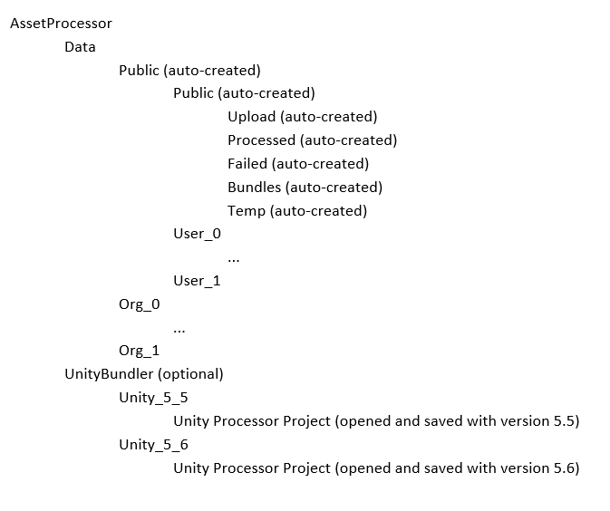

# Asset Processor Service

The Asset Processor Service is a console app that will monitor a set of folders for ZIP file uploads, and launch 3DS Max to
process the contained models - exporting multiple LOD's.  Optionally, the processor service can also launch Unity 3D 
scripts to process the models, exporting each as a Unity Asset Bundle that can be downloaded dynamically via a viewer application.

There are various settings available that will control the processor, setting the root folders for the assets as well as the specific
folders required for both 3DS Max and Unity.

Prior to running the app, create a folder (i.e. c:\AssetProcessor).  Within this folder create a "Data" folder and optionally (if Unity Asset Bundles are being created) a "UnityBundler" folder.

The asset processor will automatically create a hierarchy of folders under the "Data" folder.  The processor was designed to handle an organizational structure consisting of top-level group/org folders, as well user folders within each group.  There will be a "Public" org created, as well as a "Public" user.

The "Public" folders are generally used for assets that aren't specific to any one group/user, and are available to all.  Additionally, the viewer app will segregate the assets by group and user when viewing, so security can be maintained as required.

The most important folders are the "Upload" and "Processed" folders.  
* "Upload" folders are monitored for ZIP files to be uploaded.  The ZIP file contains the model(s) to be converted.
* "Processed" folders are the final destination for the converted files from 3DS Max. (The original ZIP is also placed here for reference.)

Additionally, the following folders may also be created as required.
* "Failed" folders contain the ZIP of file that failed conversion for any reason.
* "Bundles" folders contain the Unity Asset Bundles of the asset as well as the JSON files describing the content.
* "Temp" folders contain working files used during 3DSMax and Unity processing.

