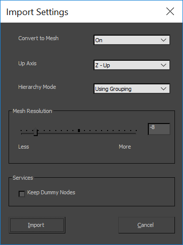
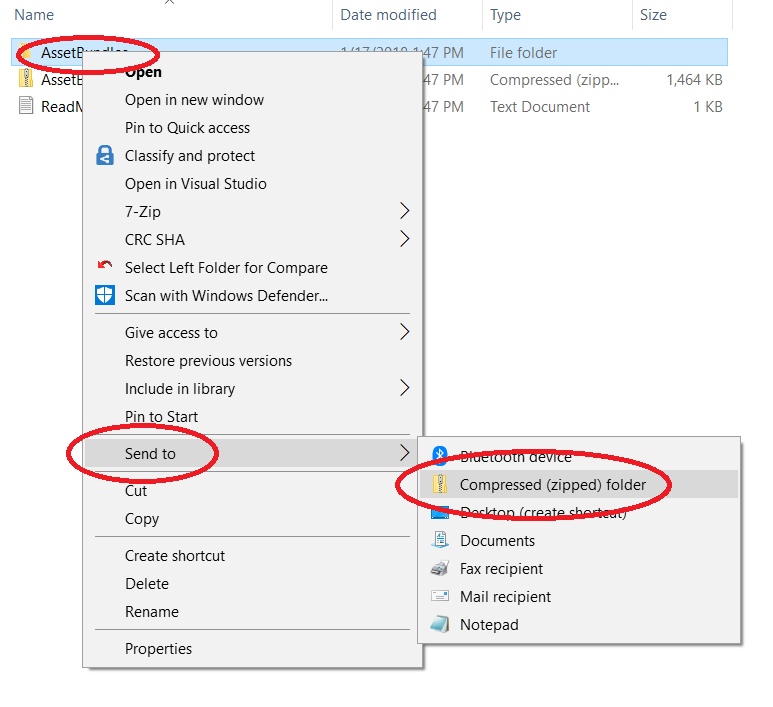
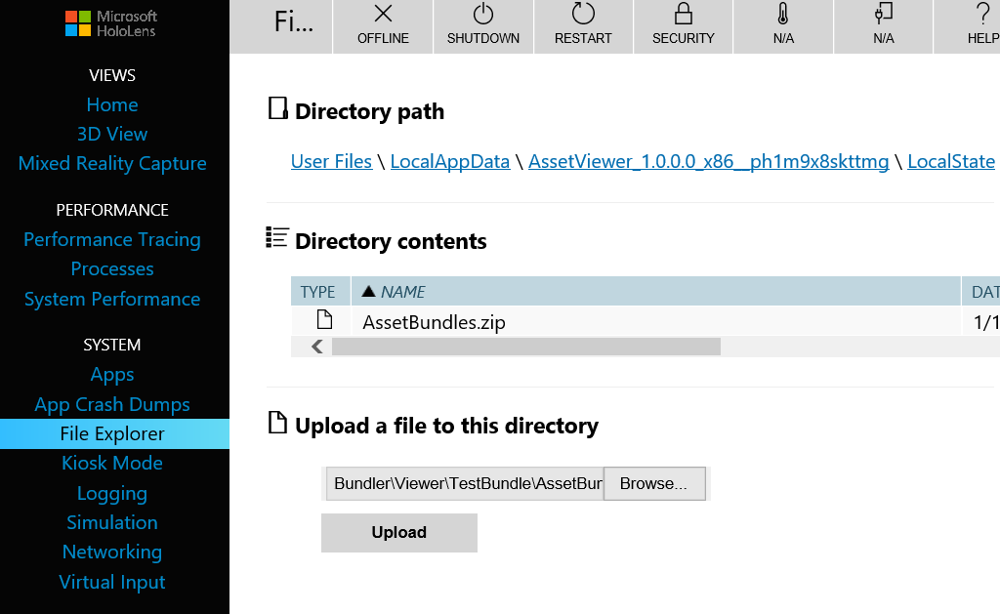

# Bundler
## Overview
Bundler is an experimental, automated process to help view CAD models on Mixed Reality devices

The goal is to have a "hands-free" automated tool to convert CAD engineering files into multiple per formant mesh level of details that can be viewed across Windows Mixed Reality devices. Through experimentation, we found that this tool cannot cover every use case or complex, large CAD assemblies. However, most of our partners found it extremely useful for being able to quickly get usable real-time mesh for sub-assembly design reviews.
## Requirements
Bundler uses Autodesk's 3ds Max to decimate and convert CAD models. 3ds Max was chosen because of the ability to import a large array of different CAD files and the availability of a scripting API. Below are the key specifications of the machine we are using:
* Windows 10 / Windows Server 2016
* Autodesk 3ds Max 2017
  * Validated it works down to 3ds Max 2015. We suggest newest version of 3ds Max to ensure best file conversation support. 
* 32+ GB of Ram
  *	Intel CPU 3.5 GHz

# Setup
Bundler is meant to run on a dedicated machine.  CAD models are placed in a special directory, and a service will automatically convert them in to Unity-loadable asset bundles.  A http server can then allow those asset bundles to be downloadable to a HoloLens running the Asset viewer application.

## Setting Up 3ds Max for Bundler
Ideally you have a dedicated machine/VM to run the Bundler service on. If you do choose to install Bundler on your primary machine and are using 3ds Max for other projects it is suggested you install a different version of 3ds Max to use Bundler with. The steps below assume that a supported version of Windows and 3ds Max is installed.
* Copy ...\Processor\Max\HoloAssetCreator.ms to your 3ds Max startup folder
  * This file is important for rendering the mesh icon. This file will now load every time 3ds Max is launched.
* Launch the version of 3ds Max you will use with Bundler
* In 3ds Max go to File -> Import and select <filename>, make sure the dialog settings match the image below. This will become your new default CAD file import settings.

* Close 3ds Max so the file settings save.
* Copy \<max script> to \<file location>

## Processor Service
This is documented in the [readme.md](Processor/ProcessorService/README.md) file for the ProcessorService

## Asset Viewer
Build the Unity project at ...\Bundler\Viewer\Unity and deploy it to your device.

If you run the viewer at this point it will try to download asset bundles from a server specified in the ServerManager ( ...\Bundler\Viewer\Unity\Assets\scripts\servermanager.cs, in the Running scene at Managers/ServerManager)  Without any changes, this won't be a valid server so the Viewer will look for bundles locally.  By default there will be no local bundles unless you build them.  To fix this you can either point the ServerManager to your http server or you can build and copy some sample local bundles.  Local bundles are not included in the repo because they need to be built with the same version of Unity as the Asset Viewer.

## Building and deploying sample local bundles
This is useful if you just want to see the Asset Viewer display a model.  It is not intended to be how you normally use Bundler.

* Open the Processor Unity project in the exact same version of Unity that you are building the viewer with.  Project is located at ...\Bundler\Processor\Unity
* In the Unity Editor there will be a "Bundle" menu.  Select CreateAssetBundles from that menu.  This will build bundles for a boat and a teapot.
* Go to the ...\Bundler\Processor\Unity\AssetBundles directory. The files there should include boat.unity3d and teapot.unity3d
* Copy those files to their respective directories under ...\Bundler\Viewer\TestBundle\AssetBundles\
* In ...\Bundler\Viewer\TestBundle create a zipped copy of the AssetBundles directory.
  * An easy way is to right-click on the AssetBundle directory, go to "Send to", and select "Compressed (zipped) folder"
  

* Use the Device Portal File Explorer to upload the new .zip file to the device.
  * The file goes in the LocalState directory of AssetViewer.
  * In the picture below that's at "Device\User Files\LocalAppData\AssetViewer_1.0.0.0_x86__ph1m9x8skttmg\LocalState".
  * Note that the Edge browser has an incompatibility that breaks uploading files in File Explorer.  Other browsers will work fine.
  

* The next time the AssetViewer starts, it will find the .zip file, un-compress it, and use the content.

# 3ds Max settings.ini parameters

**MaxTargetPlatforms** How you specify and label the number of LODs you want to create. Each string value entered should be separated by a comma.

**MaxTargetVertexCount** This will be the maximum number of vertices for each LOD level specified above. You must specify the same number of entries as MaxTargetPlatforms.

**MaxScriptLocation** The full file path and name of the max script included in this project. Formatting is important and should always have the @\" prefix and \" postfix.

**MaxInstallLocation** Used to specify the install location for which Autodesk 3ds Max version you want to use. The current is the default install location for 3ds max 2016.

**BaseDataPath** Root folder location of where you want the processor to watch for new files and keep the converted mesh data. This path must already exist and should contain no files the first time you use this processor.

**MaxDontDecimateLessThan** If a part in the mesh has less than the specified vertices the decimation tool will not decimate the part.

**CreateUnityAssetBundles** More information coming soon.
