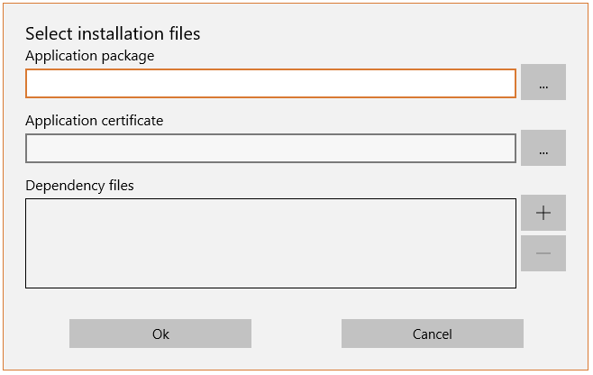
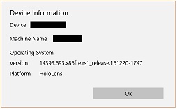

## Windows Mixed Reality Commander

Windows Mixed Reality Commander is a Universal Windows application that demonstrates using the Windows Device Portal in a classroom environment. It enables observation and management of one or more HoloLens and/or PC devices. This application is built upon the open source [Windows Device Portal Wrapper](https://github.com/Microsoft/WindowsDevicePortalWrapper) project and is used by the Microsoft HoloLens team in the Holographic Academy.

### Requirements
Windows Mixed Reality Commander requires:
- A Windows 10 Device
 - Currently tested on x86 and x64.
- A HoloLens
 - In developer mode
 - [Windows Device Portal](https://developer.microsoft.com/en-us/windows/holographic/using_the_windows_device_portal#setting_up_hololens_to_use_windows_device_portal) enabled and configured

### Building
Building Windows Mixed Reality Commander requires [Visual Studio 2015 Community and the Windows 10 SDK](https://developer.microsoft.com/en-us/windows/downloads). Visual Studio 2015 Professional and Enterise are also supported.
- Load HoloLensCommander.sln
- Build and deploy the solution.

### How to use Windows Mixed Reality Commander
Note: The first time you start Windows Mixed Reality Commander on your PC, you will need to enter credentials or set the default credentials for Windows Device Portal connections to the HoloLens.

#### Connecting to a device

##### Connect

Connects to the specified device.

Note: Leaving the address field blank, in the Connect to Device dialog, will attempt to use a USB connection between the PC and a HoloLens. This is for **development** and **side-load** scenarios only. By default Windows Store applications are not allowed to make loopback connections. At development time, Visual Studio enables loopback for your application automatically for debugging purposes. When side-loaded, you will need to explicity allow loopback connections as described in the [documentation](http://msdn.microsoft.com/en-us/library/windows/apps/hh780593.aspx).

You can optionally connect your device to a specific network access point by providing the SSID and network key in the appropriate boxes. Leaving these blank will not change your device's current WiFi settings.

When the Update Connection option is checked, Windows Mixed Reality Commander will attempt to change the IP address used for communicating with the device after the inital connection is established.

##### Additional connection commands

The additonal connection commands button (...) displays a context sensitive menu providing the following options:

- Reconnect to previous session

The reconnect command enables you to reconnect to the currently available devices that were managed in the previous Windows Mixed Reality Commander session. This command is available only if a HoloLens connection has yet to be established and the User name and Password fields are populated.

- Set credentials as default

Stores the current values of the User name and Password fields as the default credentials to be used when connecting to your device.

- Use default credentials

Replaces the current values of the User name and Password fields with the stored default credentials.

##### User name

The user name used to connect to the device.

##### Password

The password used to connect to the device.

#### Applications
The applications section allows for managing the applications running on multiple devices simultaniously.

##### Common applications list
This list shows the applications that are installed on all of the selected devices.

##### Refresh
Queries the selected devices and updates the lost of common applications.

##### Run
Runs the application selected in the common applications list on the selected devices.

##### Close All
Stops all applications that are currently running on the selected devices.

##### Install
Installs an application on the selected devices.

##### Uninstall
Uninstalls the application selected in the common applications list from each of the selected devices.

#### Mixed Reality Capture
The Mixed Reality Capture control section allows for recording and saving of Mixed Reality Capture videos from the selected devices.

Note: Mixed Reality Capture is available only on HoloLens devices.

##### Start

Starts a Mixed Reality Capture video recording. Users will notice a recording indicator in the upper left of the Holographic Frame and will experience a reduced application frame rate until the recording is stopped.

##### Stop

Stops the Mixed Reality Capture video recording.

##### Save

Files created by the Start and Stop controls, along with any other Mixed Reality Capture files created on the device (via Windows Mixed Reality Commander, the Windows Device Portal or a Cortana voice command) will be downloaded to the Pictures Library on the PC. Files will be saved to HoloLensCommander\<device address|name>.

##### Delete files after saving

Checking this option will result in downloaded Mixed Reality Capture files to be deleted from the device.

#### Device controls

The device control controls provide options (from left to right) to:

- Reboot the selected devices
- Shut down the selected devices
- Forget all connected devices

Note: All devices will be disconnected and will not be restorable via the Reconnect button.

#### Registered devices list
The right side of the Windows Mixed Reality Commander interface contains the list of connected devices along with controls to manage device selection. Each entry provides the ability to select/deselect the specific device, view summary information related to the HoloLens (battery level, etc.) as well as access to functionality specific to that device.

Summary view for HoloLens.

Summary view for Windows PC

From right to left, the Summary view contains:

- Selection check box

Unchecking this box will prevent this device from responding to commands other than those shown by clicking the Additional commands button, EXCEPT for the clear devices button in the Device Control controls.

- Additional commands button

- Device address and name

The address is the IP address of the device on your network. The name is a Windows Mixed Reality Commander only value that is not transmitted to the device.

- Set Tag button

The button to the right of where the device name is displayed allows you to set the name mentioned previously.

- Battery information and IPD (InterPupilary Distance)

Battery information includes the remaining capacity and an indication as to whether or not the device is plugged in.

- Set IPD button

The button to the right of where the IPD is displayed allows you to set update the IPD value stored on the device.

Note: Setting the IPD is available only on HoloLens devices.

- Status message

##### Additonal commands
##### Device Information

The HoloLens Information dialog displays information about the operating system installed on your device.

Also displayed is the name of the dewvice. This name is not the name from the Tag dialog and is not updated by the Windows Mixed Reality Commander.

##### Manage apps

The Manage apps dialog displays the installed and running applications on the device. From top to bottom, the available controls are:

 - Refresh the list of installed applications
 - Run the selected application
 - Uninstrall the selected application
 - Refresh the list of running applications
 - Close the selected application
 - Close all running applications

##### Mixed Reality view

The Mixed Reality view dialog allows the Windows Mixed Reality Commander user to see what the device is seeing. This feed takes a few seconds to initialize and then runs at 15 frames per second (to limit the impact on the wireless network). 

On the device, the user will see a recording indicator in the upper left of the Holographic Frame and the frame rate will be reduced. Although a recording indicator is displayed, no recording is being created.

Note: Mixed Reality View is only availabe for HoloLens devices.

##### Show Device Portal

The Show Device Portal command launches the default web browser and connects to the Windows Device Portal on the device.

##### Disconnect

Disconnects from the device and removes it from the list.

### Project dependencies
Windows Mixed Reality Commander depends on:
- Windows Device Portal
The device must be in developer mode with the Windows Device Portal enabled and paired.
- Windows Device Portal Wrapper
 - https://github.com/Microsoft/WindowsDevicePortalWrapper

### Contributing
We welcome and encourage contributions to the Windows Mixed Reality Commander project. We look forward to evolving this tool with the community!
