## Windows Mixed Reality Commander

Windows Mixed Reality Commander is a Universal Windows application that demonstrates using the Windows Device Portal in a classroom environment. It enables observation and management of one or more HoloLens and/or Windows PC devices. Along with managing a classroom, Windows Mixed Reality Commander can be used to effectively control devices in a demo environment.

This application is built upon the open source [Windows Device Portal Wrapper](https://github.com/Microsoft/WindowsDevicePortalWrapper) project and is used by the Microsoft HoloLens team in the Holographic Academy.

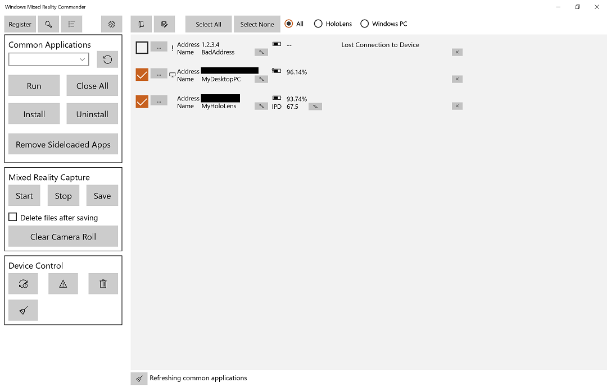

### Requirements
Windows Mixed Reality Commander requires:
* A Windows 10 Device (Currently tested on x86 and x64)
* A HoloLens or Windows PC (In developer mode with the [Windows Device Portal](https://docs.microsoft.com/en-us/windows/uwp/debug-test-perf/device-portal-hololens#set-up-device-portal-on-hololens) enabled and configured)

### Building
Building Windows Mixed Reality Commander requires [Visual Studio 2017 Community and the Windows 10 SDK](https://developer.microsoft.com/en-us/windows/downloads). Visual Studio 2017 Professional and Enterprise are also supported.
* Load HoloLensCommander.sln
* Build and deploy the solution.

### New in v2.1706
The following sections describe the changes from v2.0 to v2.1706.

#### New features
Version 2.1706 includes the following new features:
* Can now pre-register a device that is not currently on the network
* Optionally reconnect to previous device session at startup
* Configurable heartbeat interval
* Optional default SSID and Network Key
* Can specify to use and installed device certificate when connecting
* Support for changing the name of the device
* Ability to save and load a specific device session
* Ability to clear status messages
* Clear camera roll on device
* Remove all side-loaded applications

#### Changes
Version 2.1706 introduced the following behavior changes:
* Unregister devices now honors device selection (previously unregistered all devices)
* Reconnecting to a previous session defers common application updating until all devices have been registered
* Device list is sorted (at device registration time) by device name and address
* Updated collection of applications to remain running when all applications are closed	

#### Fixes
The following issues have been fixed:
* The device list now properly scrolls vertically
* Installing an application is more likely to identify any previous version
* Reconnecting to a previous session is now faster
* Improved application stability in error conditions

### Key User Interface Elements

#### Device Connection


##### Register

The **Register** button displays a dialog allowing you to target a specific device.

Before attempting to connect to a device, please be sure that the Windows Device Portal is enabled and paired with your desired credentials.

```
Note: Windows PCs must be rebooted after enabling the Windows Device Portal.
```
##### Set Credentials
Before a device can be registered, the default Windows Device Portal credentials must be set. To do so, click the  button.

##### Restore Previous Session
To restore the previous session (auto saved as devices are registered and unregistered), use the  button.

```
Note: Reconnect to previous session will become disabled after a reconnection has been attempted, a session file has been loaded or the Register button has been used one or more times.
```

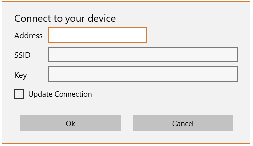

###### Address
Enter the IP Address in the **Address** field. If you are connecting to a Windows PC, you must also provide the port number (typically 50443). Checking the **Desktop PC** button will append the default Windows Device Portal port, if no port has been specified. 

To determine the correct address to specify:
* HoloLens: Run the Settings application, select Network & Internet > Wi-Fi.
* Windows PC: Run the Settings application, select Update & Security > For Developers.

##### Name
You can optionally enter a name associated with the device in the **Name** field. If the **Update Device** options is checked, the device will be renamed and then rebooted.

###### Username and Password
If you wish to use a specific set of credentials for the device, fill out the **User name** and **Password** fields. Doing so will override the default values.

###### SSID and Key
If you wish to set your device onto a specific network access point, enter the **SSID** and **Network key**. If you have previously set defaults for these values, they will be automatically populated. As with user name and password, making changes to SSID and Network key will override the default values for the connection.

```
Note: If you specify an SSID, the device may become unreachable if the PC does not have access to the new address. 
```

###### Use Installed Device Certificate
If you have previously downloaded and installed the device's root certificate, you can select **Use Installed Device Certificate**. Otherwise, the certificate wil be automatically downloaded, though it will not be installed.

###### Update Connection
Checking **Update Connection** instructs Windows Mixed Reality Commander to query the device for the first valid (non-169.x.x.x) IP address it reports. 

##### Connection Shortcut for Development Machines and Side-Loading
Getting the IP address from your HoloLens can be a more time-consuming process than getting it from your Windows PC (ex: ipconfig).

Users of the Windows Device Portal are aware of the ability to connect to an attached HoloLens using the loopback address (http://127.0.0.1:10080) when the Windows Phone IP over USB Transport service is installed (available as part of the Windows 10 SDK) and running.

To take advantage of this feature, Windows Mixed Reality Commander will default to this loopback address if the Connect dialog’s Address field is left blank.

```
Note: By default, UWP applications are subject to network isolation. For development and 
side-load scenarios, your PC can be configured to allow an application to establish
loopback connections.

Building Windows Mixed Reality Commander using Visual Studio, on the PC on which it will
be run, will automatically configure to allow loopback connections.

For side-load scenarios, please refer to the documentation describing network isolation
troubleshooting (https://msdn.microsoft.com/en-us/library/windows/apps/hh780593.aspx). The application container name, at the time of this writing, for 
Windows Mixed Reality Commander is “HoloLensCommander_ksbfhw2wnm4q4”.
```

#### Session Management
The **Session Management** controls allow you to create and use a library of sessions that you can easily switch between.


##### Load Session
The  button loads a saved device session file. Loading a file removes all devices in the current session and replaces them with the devices from the file.

```
Note: If a device's IP Address changes after the session has been saved, the device will need to be re-registered (and the old registration unregistered).
```

##### Save Session
The  button saves the current session to a file.

#### Common Applications
The **Common Applications** section displays and controls applications that are common to all selected devices. Each time a device is selected or deselected, this list is updated.

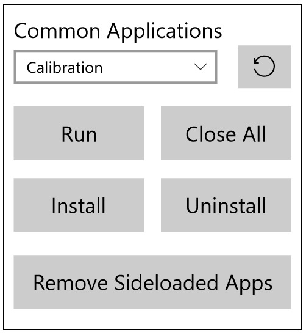

##### Run
The **Run** button will start the selected application on the selected devices.

##### Close All
The **Close All** button will stop all running UWP applications on the selected devices. 

##### Install
The **Install** button will open a dialog box for selecting the files required for installation.

 Launches the folder picker. Allows the user to select an installation folder and automatically populate the dialog box with the correct installation files.

##### Uninstall
The **Uninstall** button will uninstall the selected application on the selected devices.

##### Remove Sideloaded Apps
The **Remove Sideloaded Apps** button will uninstall all sideloaded applications on the selected devices.

#### Getting the Application Install files
To install an application, you will need to specify the application package (appx or appxbundle), certificate (cer), and dependency (appx) files.

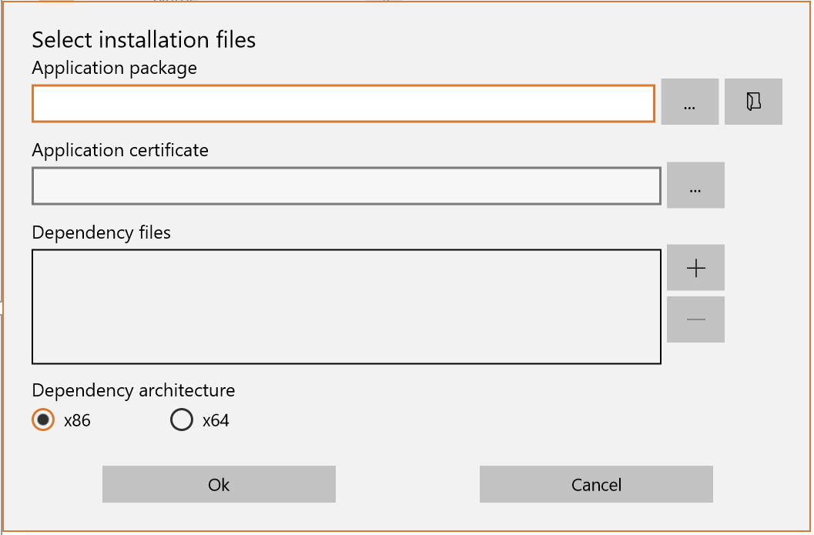

You can browse to specific files using the  or you can have Windows Mixed Reality Commander automatically determine the required files by selecting a folder using the  button.

#### Mixed Reality Capture
The **Mixed Reality Capture** section allows you to start and stop a recording on the selected devices. You can also save them to the PC running Windows Mixed Reality Commander and optionally delete them from the device after they have been saved locally.

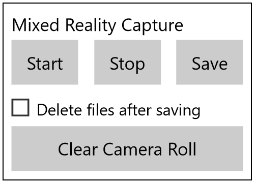

Files are saved to your PC’s Pictures Library under HoloLensCommander, and each device’s files will be placed in a folder named after the device’s address or tag.

```
Note: Windows PC devices do not support Mixed Reality Capture.
```

##### Start
The **Start** button begins recording a Mixed Reality video on the selected devices. On the device, a recording indicator will appear in the upper left.

##### Stop
The **Stop** button ends the Mixed Reality recording session on the selected devices. The file will be saved to the device's Camera Roll.

##### Save
The **Save** button downloads all files from the Camera Roll on the selected devices.

##### Delete files after saving
Checking the **Delete files after saving** option deletes each file in the device's Camera Roll once it has been downloaded.

##### Clear Camera Roll
The **Clear Camera Roll** button wipes all saved photos, videos, and mixed reality captures on each selected device. 

#### Device control

The **Device Control** section allows you to bulk reboot or shutdown the selected devices. It also allows you to instruct Windows Mixed Reality Commander to unregister specific devices.

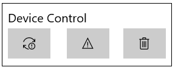

 Reboots the devices selected in the device list. Devices will show “Lost connected to the device” while rebooting and will reactivate upon completion.

 Shuts down the selected devices. Devices remain in the list and will report “Lost connection to the device”.

 Unregisters the selected devices by removing them from the devices list and updating the application state.

 Clears the status messages for the selected devices.

```
Note: If Windows Mixed Reality Commander has lost contact with a device, the Lost Connection message will reappear automatically after the status message has been cleared.
```

#### Device List
When you connect a device (HoloLens or Windows PC) an entry will be created in the device list (right side of the UI).

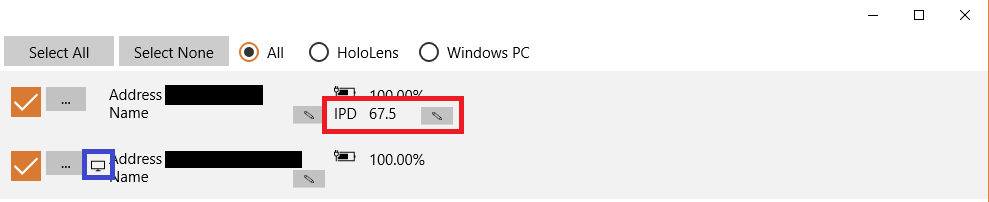

In the previous image, the upper device is a HoloLens and the lower is a Windows PC. You can differentiate, at a glance by the items highlighted in the black, blue and red boxes.

The HoloLens supports viewing and setting the interpupillary distance (IPD) and provides controls to view and update the value (red box).

Windows PC devices do not support the IPD controls and have a small icon (blue box) between the additional options button (…) and the address.

Devices that are not available at the time of registration display an exclamation point (black box) icon. Once a connection has been established, the device UI will be refreshed based on the type of device (HoloLens or Desktop PC).

#### Managing Applications on an Individual Device
There are times when you need to manage applications on a single device. To accomplish this, select the Manage apps from the menu displayed when clicking the additional commands button (…).

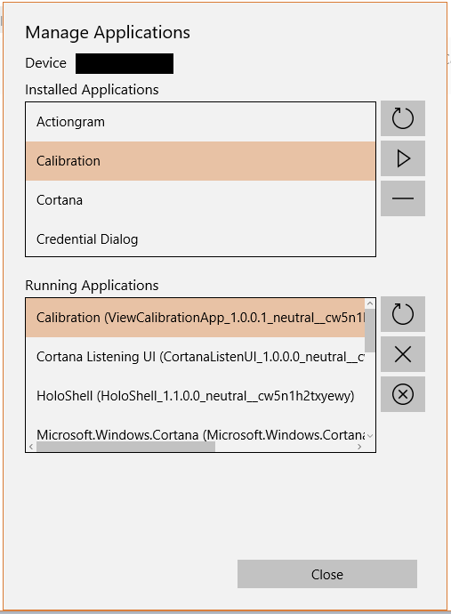

 Runs the app selected in the Installed Applications list.

 Uninstalls the app selected in the Installed Applications list.

 Uninstalls all sideloaded apps listed in the Installed Applications list.

 Stops the app selected in the Running Applications list.

 Stops all apps listed in the Running Applications list.

### Using Windows Mixed Reality Commander
Windows Mixed Reality Commander can manage one or more HoloLens and/or Windows PC devices in a classroom or demo setting. The following sections describe common usage patterns for both settings.

#### Customizing for the User
HoloLens is designed for all users. The headband is adjustable to fit different sized heads and the optics are designed to allow for different distances between the eyes (interpupillary distance).

To promote user comfort and hologram clarity, it is recommended to configure the IPD to match the user. There are two convenient methods for setting this value.

##### Directly Setting the IPD


If the user is already aware of his/her IPD, you can use the edit button to the right of the IPD to set it directly.

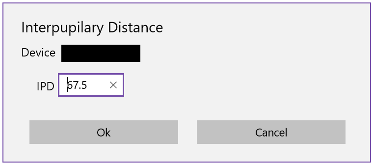

Clicking Ok will send the desired value to the HoloLens. Within a few seconds, the UI will be updated to reflect the new setting.

##### Running Calibration on the HoloLens
If the user is not aware of his/her IPD, you can run the HoloLens Calibration application to have the value measured and set.

There are two ways this can be performed using Windows Mixed Reality Commander:

1.	Start and run Calibration on ALL selected devices.
2.	Run Calibration on a specific device using the Manage apps option for that device.

While Calibration is running you will see “Waiting for Calibration to exit” in the device control. When complete, the control will display “Calibration has exited”.

#### Controlling Application Lifetime
Controlling application lifetime is a common requirement when running a classroom or demo.  Students and users often are required to spend a finite time in any given experience before moving on to the next task.

Windows Mixed Reality Commander enables application lifetime control by using the Common Applications controls or the Manage Apps option for a specific device.

When an application is running on a device, you will see "Waiting for Application to exit" on the right side of the appropriate device list entry.


When the application has been closed, by the user or via Windows Mixed Reality Commander, the message will change to "Application has exited".

#### Assisting Users
Mixed Reality is a new experience for many users, and they may, at times, get confused with where to look and/or how to interact with your application. To help you help your users, Windows Mixed Reality Commander provides Mixed Reality view.

```
Note: Mixed Reality View is only available for HoloLens devices.
```

Mixed Reality view allows you to see what your user is seeing, enabling you to guide and assist him/her.

```
Note: Windows Mixed Reality Commander supports Mixed Reality view for one HoloLens device at a time.
```

To turn on Mixed Reality view, click the additional options (…) button for the device and select Mixed Reality view.

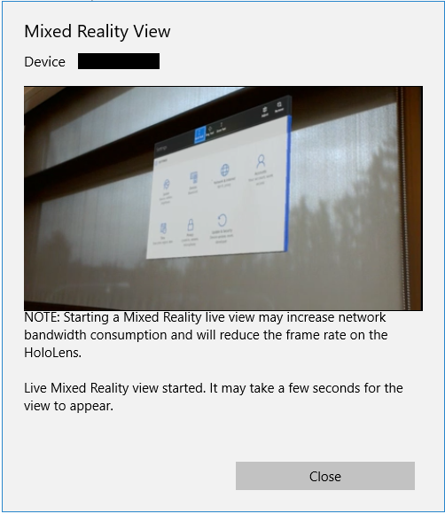

This will cause the user to see a red "REC" indication, in the upper left of the Holographic Frame. It is recommended that you tell your user to expect to see this. The indicator will turn off when you close the Mixed Reality view dialog.

#### Keeping Track of Devices
If you are managing multiple devices, it can become challenging to keep track of who is using which device. To make that easier, Windows Mixed Reality Commander allows you to tag the device with a custom name that is not communicated to the device. 

For example, you may have 30 HoloLens devices in your classroom and notice that a student named Mick is having trouble with his assignment. Rather than having to memorize that IP address 10.254.130.7 is Mick's device, you can select the edit button next to the Name field to display the Tag Device dialog.

 Displays a dialog allowing you to set a local name for the device. It also, optionally, allows you change the device's name.

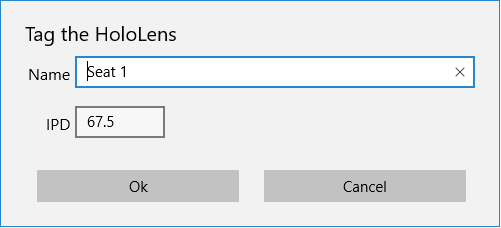

Checking the **Update Device** option will change the name on the device and reboot it. Once rebooted, the connection will be re-established using the updated device certificate.

#### Settings
The  displays a dialog that allows you to configure the behavior of Windows Mixed Reality Commander.


##### Auto-Reconnect
The **Auto-reconnect to previous session** option enables the automatic loading of the device session file that is auto-saved as devices are registered and unregistered.

##### Heartbeat interval
The **Heartbeat Interval** specifies the number of seconds between attempts to verify device availability.

##### Expand credentials
Checking **Expand credentials** tells Windows Mixed Reality Commander to expand the credentials controls in the **Register device** dialog.

##### Expand network settings
**Expand network settings** controls whether or not the SSID and Network key controls are expanded in the **Register device** dialog.

##### Use installed device certificate
Checking **Use installed device certificate** tells Windows Mixed Reality Commander to not download the root certificate for the device because the certificate has already been downloaded and installed in the certificate store.

##### Default SSID and Network Key
If you need to add your devices to a specific network access point, you can simplify the task by setting default values for the SSID and Network Key. These will be used, by default, when connections are established.

```
Note: If you specify an SSID, the device may become unreachable if the PC does not have access to the new address. 
```

### Project dependencies
Windows Mixed Reality Commander depends on:
* Windows Device Portal - The device must be in developer mode with the Windows Device Portal enabled and paired.
* Windows Device Portal Wrapper (https://github.com/Microsoft/WindowsDevicePortalWrapper)

### Contributing
We welcome and encourage contributions to the Windows Mixed Reality Commander project. We look forward to evolving this tool with the community!


