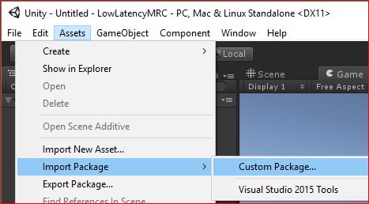
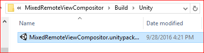
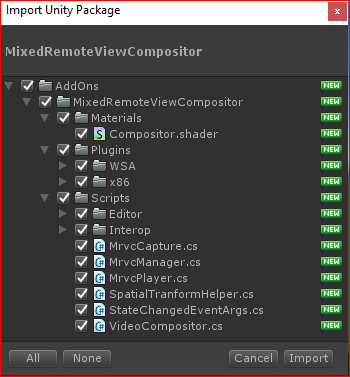
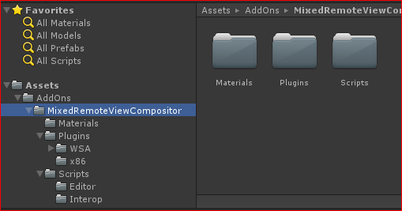
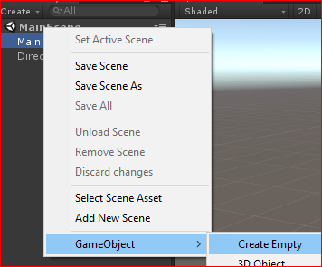
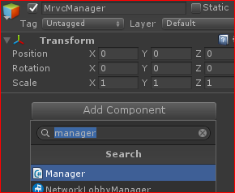
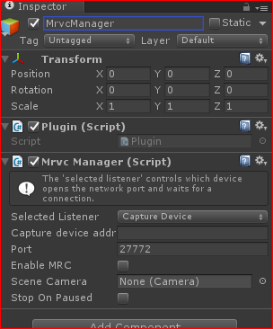
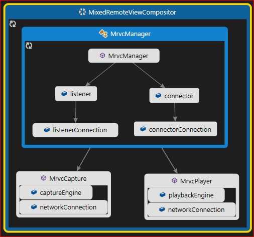
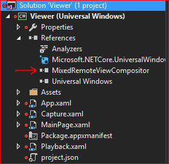
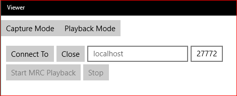

## Low Latency MRC
The steps below will show how to include the provided package into a Unity project. Developers new to Unity may want to review the resources provided [here](../../README.md).

The following will go throught the process of importing the package into Unity and configuring it for low latency MRC. The full source and sample is provided in the Unity folder.

1. Launch Unity and create a new scene or open a new project.
2. From the Assets menu, select Import Package > Custom Package:
   
3. From the File Explorer, navigate to the Build folder, from the repo folder, and select the MixedRemoteViewCompositor.unitypackage file: 
   
+ This will bring up a new window to select the import package. The package provided contains the core files needed to use the components in Unity. The LowLatencyMRC sample provides more sample code and a complete project to work from. Click "All" and "Import" buttons, to complete the Import process:
   
+ Expand the AddOns folder from the Assets panel, and confirm the MixedRemoteViewCompositor folder is there:
   
4. From the Hierarchy Panel, create a GameObject and name it "MrvcManager":
   
5. Select this GameObject and add the "Mrvc Manager" script. This can be done via the Component menu (Component > Mixed Remote View Compositor), drag and drop the script, or click "Add Component" in the Inspector panel:
   
6. By adding this component, it will also add the "Plugin" script:
   

The MrvcManager is a higher-level component that will setup the network connections and start the capture/playback process automatically. If more control is required, for instance delaying when capture or playback begin, files in the Scripts > Interop folder can be used leveraged for custom scenarios.

### Configuring the MrvcManager for LowLatencyMRC
MrvcManager will manage the creation of a Capture and Playback objects based on a Connection object. The Connection will be created when a Listener receives a connection request from a Connector. By default, the HoloLens is the Capture Device and should be configured to be a Listener. When the app is launched on the device, it will enter the Listening state automatically. This makes it easier to establish a connection.

**Device address:** In the default mode, Capture Device is the Listener, this value does not need to be set. If configuring the manager as a Playback device, change the value to the IP address or network name for the HoloLens device. When the HoloLens is configured to be a Connector device, some way to trigger a connection and configure IP addresses will be required. 

**Port:** The default port to establish the connection. 

**Enable Mrc:** This property is required to configure the capture device to automatically ensure the compositing is done during capture. This is required for the LowLatencyMRC, without this property enabled only the PV camera images will be seen.

**Scene Camera:** not required for Low Latency MRC. For MRVC, this value will populate with the Main Camera for the scene. No changes are required when using the UWP viewer applicaiton.

**Stop On Paused:** if required, this can be configured to automatically stop when the application is not in focus. 

### Build and Deploy
Add some 3D objects to the world before compiling and deploying the application to the HoloLens. 

For instructions on exporting the project from Unity and the recommended settings, please refer to the following links in the documentation:
  * [Exporting and building a Unity Visual Studio solution](https://developer.microsoft.com/en-us/windows/holographic/exporting_and_building_a_unity_visual_studio_solution)
  * [Recommended settings for Unity](https://developer.microsoft.com/en-us/windows/holographic/recommended_settings_for_unity)

In addition to the above settings, add the following capabilities to the publishing settings(Edit > Project Settings), to ensure access to the camera and network:
  * InternetClientServer
  * InternetClient(optional)
  * WebCam
  * PrivateNetworkClientServer

## UWP Viewer application
Once the application is deployed to a HoloLens, the UWP Viewer application is provided as the companion application. This is located in the UWP folder. 

**Note:** *The project contains a reference to MixedRemoteViewCompositor.winmd that is located in a matching configuration folder in the Build directory. If compiling the source to a different folder, update the references as required.*

1. Load the Viewer.sln in Visual Studio, and ensure the MixedRemoteViewCompositor reference is included:

2. Compile and run the application. 
    * The HoloLens should be running an application with the MRVC component configured with MRC enabled as described above. 
3. Click the “Playback Mode” Button:

    * *"Capture Mode" provides code on how to use the component in a UWP application, such as an exclusive mode D3D application.*
4. From Playback Mode, change “localhost” to the HoloLens device IP address and update the port and click the "Connect To" button. 
    * Once connected, “Start MRC Playback” will be enabled.
5. Click "Start MRC Playback" button to begin. 
   * If playback fails(network conditions may prevent startup), stop and start again or restart the device if needed.
