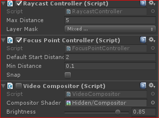
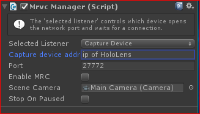
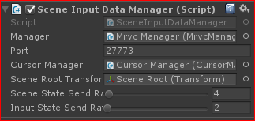
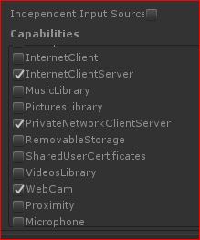

## Mixed Remote View Compositing
As noted in the [documentation](https://developer.microsoft.com/en-us/windows/holographic/mixed_reality_capture_for_developers), there are known issues that can affect the holographic experience when using MRC. Using mixed remote view compositing can avoid some of these limitations but does require more development resources.

Every PV captured image does provide its transformation with respect to the world. This translation, in addition to the camera image, can be used to move a virtual camera in a mirrored application and render the scene with respect to that transformation. MRVC will composite the PV image and the mirrored scene rendering frame to reproduce a similar MRC experience. However, the mirrored application viewing experience has no knowledge of any state changes or if any objects moved.

That is where scene and input state syncing is required. This is an advanced topic and something to consider. The MRVC sample provides a starting point to demonstrate this idea. The sample is configured to sync camera transformation and composites the scene with the PV image on the main camera. As a quick demonstration, the scene data manager provides a way to update cursor locations with respect to the HoloLens viewer.

When reviewing the sample, consider what type of experiences you are developing and how many scene state updates are required to keep syncronized.

**Note:** *Transformation data are with respect to the PV camera of the device and not the user's gaze. This is illustrated in the Unity editor with Red and Yellow debug lines.*

### Sample
Load the MRVC sample to review how this sample is different and what changes were made to create the mirrored experience from the same application. The editor will act as the viewer application, but it can be built and deployed to run on a computer that does not have Unity installed.

As with the the Low Latency sample, import and add the MrvcManager to start. Below will outline the changes that were made to the core components for MRVC.

#### Main Camera
The main camera is used both for scene rendering and the final composite. Consider using a virtual camera to render the scene and composite its render target for the final output.

**Raycast Controller:** this component tracks the HoloLens user’s gaze. This information is used locally within the application for the CursorManager, but is also used remotely for the input data in the mirrored application. The Layer Mask is set to include everything but the "Ignored layer". The cursor renders on the Ingored layer. 

**Focus Point Controller:** As a best practice for HoloLens, applications should be setting the Focus Point to ensure stable holograms. This is a helper for the HoloLens application.

**Video Compositor:** Disabled for the HoloLens application, but will become active when the mirrored application receives camera frame updates. This script handles moving the camera into the correct position and does the final composite with the camera image. A composite shader is provided to simulate the MRC viewing experience.

#### MrvcManager
The component that works with the MixedRemoteViewCompositor plugin components. 

**Capture/Playback device address:** set this to the HoloLens IP address. When the viewing application gets started, this address will be used to connect the viewer to the HoloLens application. 

**Enabled MRC:** is disabled to ensure compositing is not done on the device.

**Scene Camera:** Main Camera for the scene.

#### GUI Buttons
Since the HoloLens application and the remote viewing application are the same, we need a way to interact with the player to allow it to connect to the HoloLens. This is a simple script that will display buttons in the Editor to initiate the connection.

#### Scene Root
The main root object for all objects rendered in the world. This is our helper script that helps sync scene object and input data to the remote system from the HoloLens.

**Manager:** A link to the MrvcManager. The manager has state data and will trigger the script to initiate a Listener and Connector object based on what state the manager is in. Additionally, we get the remote IP address for the HoloLens from its configuration.

**Port:** Since we are using a separate connection from the media pipeline, a different port number is required to listen for a connection. 

**Cursor Manager:** Used to update the cursor location to where the cursor is located on the remote device

**Scene Root Transform:** GameObject transform object to send and sync on the remote device. This is a simple demo, as an alternative look into other networking components such as [Unity NetworkTransform](https://docs.unity3d.com/Manual/class-NetworkTransform.html)

**Send rates:** large amounts of data can quickly flood a network connection. These sliders can dial down the rate at which the data is sent. The faster send rates can cause more latency on video playback.

### Build and Deploy
Add some 3D objects to the world before compiling and deploying the application to the HoloLens. 

For instructions on exporting the project from Unity and the recommended settings, please refer to the following links in the documentation:
  * [Exporting and building a Unity Visual Studio solution](https://developer.microsoft.com/en-us/windows/holographic/exporting_and_building_a_unity_visual_studio_solution)
  * [Recommended settings for Unity](https://developer.microsoft.com/en-us/windows/holographic/recommended_settings_for_unity)

In addition to the above settings, add the following capabilities to the publishing settings(Edit > Project Settings), to ensure access to the camera and network:
  * InternetClientServer
  * InternetClient(optional)
  * WebCam
  * PrivateNetworkClientServer

