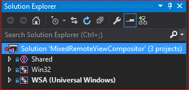
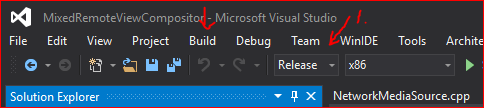
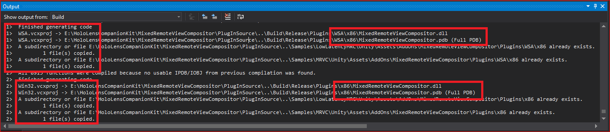

## Plugin Source files
This folder contatins all source files required to compile the Win32 and UWP component libraries(.dll). Any changes made to these files will require that both Debug **and** Release configurations are built to ensure all files are updated and deployed appropriately. 

### Project Files
**Shared** - contains all the source files used in the Win32/WSA projects

**Win32** - Win32 build used for Unity Editor and other Win32 desktop applications.

**WSA** - UWP build used for HoloLens and other Windows 10 applications.

### Build Instructions
Load the MixedRemoteViewCompositor.sln file from the MixedRemoteViewCompositor/PluginSource folder. There should be three projects listed in the Solution Explorer. 

Be sure Release is selected from the Configuration Manager: 

From the menu, select Build > Rebuild Solution to start the build process. This will ensure a clean build and the post-build scripts are executed.

Review the Output window to ensure the build was successful, and the files were copied to the folder specified in the build settings.

Win32 and WSA projects will compile binaries to the Build/$(Configuration)/Plugins{/WSA}/$(PlatformShortName) folder. 
  + $(Configuration) = Debug/Release
  + $(PlatformShortName) = x86
  When the build is successful, there are post build event scripts that will then copy the .dll's to the Unity sample folders.

***Note:** When deploying a Unity HoloLens application, use the **Release x86** build of .dll*
