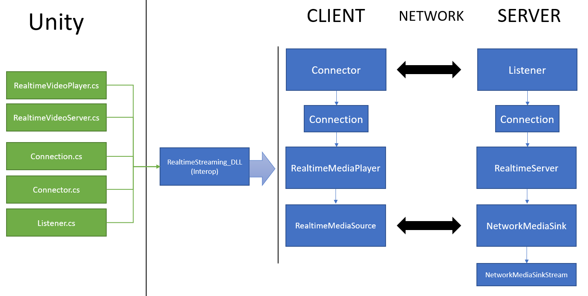
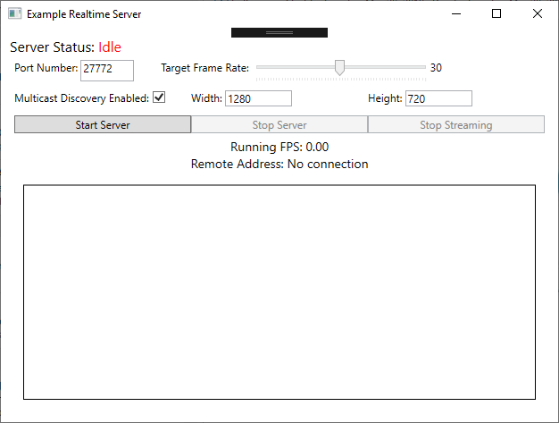

# Real-time Streaming

## Overview
This component provides client/server infrastructure to support real-time streaming (video only) between two device endpoints with particular support for Unity/HoloLens applications. The foundation of this component utilizes the [Media Foundation](https://docs.microsoft.com/en-us/windows/desktop/medfound/microsoft-media-foundation-sdk) and [Universal Windows Platform](https://docs.microsoft.com/en-us/uwp/) APIs to stream encoded video across a TCP-based connection. As such, this component will only function on Windows-based platforms.

## Architecture



The architecture of this component is designed to support two stages during runtime: 1) establish connection and 2) stream video. Further, the architecture can be split along code to support encoding video (i.e server code) and decoding video (i.e client code).

### 1) Establishing a connection
The [**Connector**](source/shared/connector.h) and [**Listener**](source/shared/Listener.h) classes function to establish a connection between the two device endpoints either via a targeted IP address or via UDP discovery. A **Listener** object should run on the server waiting for an incoming connection with a client. The client should create a **Connector** object when it wishes to start a connection. The **Listener** object should be started before the **Connector** object. Once a TCP connection is established, a resulting **Connection** class object is created by both the Listener and **Connector** classes. This [**Connection**](source/shared/connection.h) object is utilized in the next stage by both client & server code instances.

### 2) Client & server
Once a **Connection** object is created, a [**RealtimeMediaPlayer**](source/shared/realtimemediaplayer.h) and a [**RealtimeServer**]((source/shared/realtimeserver.h) object are created on the client and server devices respectively and initialized with the created **Connection**. The **RealtimeMediaPlayer** creates the necessary MediaFoundation components, in particular [MediaPlayer](https://docs.microsoft.com/en-us/uwp/api/windows.media.playback.mediaplayer) and [MediaStreamSource](https://docs.microsoft.com/en-us/uwp/api/windows.media.core.mediastreamsource), to support receiving and decoding video frames from the server which are written to a shared DirectX texture. The **RealtimeServer** likewise initializes Media Foundation components, in particular [IMFSinkWriter](https://docs.microsoft.com/en-us/windows/desktop/medfound/tutorial--using-the-sink-writer-to-encode-video), [IMFMediaSink](https://docs.microsoft.com/en-us/windows/desktop/api/mfidl/nn-mfidl-imfmediasink), and [IMFStreamSink](https://docs.microsoft.com/en-us/windows/desktop/api/mfidl/nn-mfidl-imfstreamsink), to support the sending of encoded frames to the client over the TCP connection.

### Important considerations

This component is primarily built to support streaming to a HoloLens Unity application and thus there is an additional interop layer to function between Unity and the objects above. In the Unity samples provided, there are additional C# classes to wrap calls into the C++ plugin classes above. The important difference is that the **RealtimeVideoPlayer.cs** and **RealtimeVideoServer** classes incorporate both stages, establishing a connection and streaming video, above to simplify interop.

Finally, it is important to note that the only currently supported output texture format on the client is [DXGI_FORMAT_NV12](https://docs.microsoft.com/en-us/windows/desktop/api/dxgiformat/ne-dxgiformat-dxgi_format) or also known as YUV 4:2:0. This is to ensure performant video decoding to support the real-time playback, especially on the mobile HoloLens device.

Further, only client playback in the Unity app environment is currently supported at the moment. Custom shaders to support rendering of the **YUV 4:2:0** texture format are available under *Samples/Unity/Assets/RealtimeStreaming/Shaders*.

For more information concerning YUV video formats: 
- [Recommened 8-bit YUV formats for Video Rendering](https://docs.microsoft.com/en-us/windows/desktop/medfound/recommended-8-bit-yuv-formats-for-video-rendering)
- [10-bit and 16-bit YUV Video Formats](https://docs.microsoft.com/en-us/windows/desktop/medfound/10-bit-and-16-bit-yuv-video-formats)

## File & folder structure

This section will discuss the folder structure of the code and samples. For more detailed information drill down into the appropriate readme. 

- [Plugin Source](Source/README.md)
- [Unity Sample](Samples/Unity/README.md)
- [WPF Sample](Samples/WPF/README.md)

```
+-- Source
|   +-- Shared
|   +-- RealtimeStreaming.sln (Start here)
+-- Samples
|   +-- Unity
|       +-- Assets
|           +-- Example
|           +-- RealtimeStreaming
|   +-- WPF (Server Example)
|       +-- RealtimeStreaming.sln (Start here)
|   +-- UWP (Client not currently supported outside of Unity)
|       +-- Viewer.sln (Start here)
+--
```

### Source

The C++ source is the code for the core plugin including the Unity plug-in wrapper, Network and Media Foundation components. This folder includes the native C++ files used to build plugin binaries for Win32 and UWP applications(i.e winmd/DLLs).

The source code can be viewed by opening the **RealtimeStreaming.sln**. This solution is supported in Visual Studio 2017 and requires support for [C++/WinRT](https://docs.microsoft.com/en-us/windows/uwp/cpp-and-winrt-apis/intro-to-using-cpp-with-winrt). Instructions for the C++/WinRT Visual studio extension support and install can be found [here](https://docs.microsoft.com/en-us/windows/uwp/cpp-and-winrt-apis/intro-to-using-cpp-with-winrt#visual-studio-support-for-cwinrt-xaml-the-vsix-extension-and-the-nuget-package). 

The source is built into a **RealtimeStreaming.winmd** file and related DLLs that can be ingested in either a Unity application, a UWP application, or a bridged-WPF application (to support UWP). The samples provide example app code to utilize the core plugin (winmd & dll files) in both a client or server device endpoint.

**NOTE:** When building the Source **RealtimeStreaming.sln**, the visual studio projects have been pre-configured to auto-place the compiled binaries into the appropriate folders for each sample folder based on the architecture being built (i.e ARM, x86, x64).

### Samples

This folder showcases some example apps functioning as a server or client on various application platforms. NOTE: At the moment, client functionality is only supported in Unity.

#### Unity

Under the Unity Assets folder provided, there are two key folders: the **Example** folder and the **RealtimeStreaming** folder. The **Example** folder provides the Unity scenes, classes & functionality specific to these demos. The **RealtimeStreaming** provides the core interop classes to be utilized in any Unity application.

- *RealtimeStreaming/Scripts* - Developers will primarily utilize these classes to interact with the core plugin. These classes are wrappers with extern C++ calls into the DLL plugin code.
- *RealtimeStreaming/Plugins* - The DLLs and WinMD files built per architecture platform (i.e x86, x64, ARM) from the core source code visual studio solution mentioned above.
- *RealtimeStreaming/Shaders* - The custom shader designed to render the YUV video format from the player for efficient video streaming

Further, it should be noted that the Unity folder also has the [Mixed Reality Toolkit for Unity](https://github.com/microsoft/MixedRealityToolkit-Unity) to support input & UI interactions on Mixed Reality devices. 

**NOTE:** Building for a Mixed Reality application or using MRTK are NOT considered mandatory for utilizing this real-time streaming component.

#### WPF

The Real-time Streaming core plugin (i.e winmd & DLLs) requires the [Universal Windows Platform](https://docs.microsoft.com/en-us/windows/uwp/get-started/) environment to execute. To bypass the necessity of building a UWP application, a developer may instead build on [WPF(Windows Presentation Foundation)](https://docs.microsoft.com/en-us/dotnet/framework/wpf/) using a bridged-application solution. This folder contains an example of this "bridged" development which effectively *merges* two applications into one: 1) a WPF project and 2) a UWP project. See [Desktop Bridge](https://docs.microsoft.com/en-us/windows/msix/desktop/desktop-to-uwp-root) to learn more.

This sample provides a simple UI to create a server application that when connected with a client will stream a single but changing color image.

## Building & testing

This section describes the process for building & deploying a streaming solution between a desktop server machine and a HoloLens client utilizing the sample app code provided. 

**IMPORTANT:** This sample requires that both the desktop server and HoloLens client are connected to the same access point and that the router properly supports UDP discovery. Otherwise, the Unity client application can be modified to target the hardcoded IP address of the desktop server to connect directly instead of discovery.

### Build the plugin
The first step is to build the Real-time Streaming source plugin to generate the necessary Winmds/DLLs to utilize in your application. Open **Source/RealtimeStreaming.sln** in Visual Studio, select your targeted architecture (x86, x64, ARM) for master, and build the solution. 

**IMPORTANT:** The Win32 & UWP projects in this VS solution have been preconfigured to automatically place the resulted binaries in the appropriate folder for each sample. For example, the binaries will be copied to *Samples/Unity/Assets/RealtimeStreaming/Plugins/{Arch}/*. It should also be noted that ARM64 binaries are only supported in Unity 2019+ and will not be recognized in Unity 2018.

### Build & run the server

After building the plugin binaries above, open the WPF server sample (*Samples/WPF/RealtimeStreaming.sln*) in Visual Studio. Build & run this solution on your local development machine. 

**NOTE:** You may have to re-reference the Windows winmd. Under the *DesktopServerApp* project, expand *References*, if there is a warning icon for the *Windows* item then you need to find your local copy. Right-click *References*, and then *Add Reference*, then select the *Browse* tab and then the *Browse* button on the bottom. Navigate to the appropriate *Windows.winmd* file for your installed Windows SDK environment. The path will be comparable to this: **"C:\Program Files (x86)\Windows Kits\10\UnionMetadata\10.0.18306.0\Windows.winmd"**.

Once the server WPF application is running, select the desired properties for the server and click *Start Server*.



For more information about this sample, read [WPF Sample](Samples/WPF/README.md).

### Build the client

After building the plugin binaries above and running the server example instance, open the [sample client scene in Unity](Samples/Unity/Assets/Example/Scenes/realtime-client.unity). It is recommended to utilize [Unity 2018 LTS](https://unity3d.com/unity/qa/lts-releases). 

**NOTE:** Ensure *Virtual Reality Supported* is checked under *Player Settings > XR Settings* as well as the *InternetClient*, *InternetClientServer*, and *PrivateNetworkClientServer* capabilities are checked under *Player Settings > Publishing Settings > Capabilities*.

Open the *Build Settings* dialog in Unity, select the Universal Web Platform environment, click the *Add open scenes* button, and then select *Build*. This will build a UWP visual studio solution in your selected folder. Once Unity completes building, open the new VS solution, and build the Master version of this solution and deploy to your HoloLens device. 

With the client running, select the *Discover* button in the demo app which should automatically discover & connect the two device endpoints and begin streaming.

## Troubleshooting
This section reviews the most common issues for failed streaming scenarios.

* Ensure the server is running AND listening for connections before the client
* Ensure both devices are connected & visible on the same access point
* Ensure both devices have supported encoders/decoders for the selected codec (i.e H.265)
* Ensure the access point is properly configured for UDP discovery
* Ensure the application is not trying to change the resolution of images while streaming at runtime

Applications can also be debugged by looking at the logs produced in the Output of an attached Visual Studio instance. It is also possible to debug & walk the plugin source code by attaching the Source VS solution to the running server or client process (In Visual Studio, *Debug* > *Attach to Process*).

## Additional Resources

- [Develop UWP apps](https://developer.microsoft.com/en-us/windows/develop)
- [Unity - Learn](https://unity3d.com/learn)

For more technical background on Media Foundation:

- [Microsoft Media Foundation](https://msdn.microsoft.com/en-us/library/windows/desktop/ms694197(v=vs.85).aspx)
- [Media Sources](https://msdn.microsoft.com/en-us/library/windows/desktop/ms697527(v=vs.85).aspx)
- [Media Sinks](https://msdn.microsoft.com/en-us/library/windows/desktop/ms701626(v=vs.85).aspx)