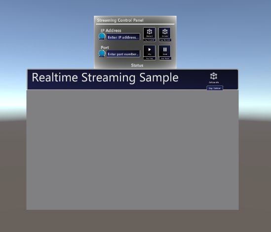
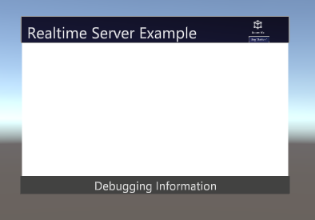

# Unity Real-time Streaming Sample

## Overview

This folder provides multiple example scenes demonstrating how to create client and server UWP applications using Unity. There are two sets of primary content: 
1) the core Unity plugin source that provides wrappers around the component functionality to work within Unity.
2) Example-specific code and assets to demonstrate the real-time streaming component

Under the **Assets** Unity folder, the **RealtimeStreaming** folder contains the C# wrappers and DLLs for the real-time streaming component while the **Example** folder provides the Unity scenes, classes & functionality specific to these demos. Further, it should be noted that the Unity folder also has the [Mixed Reality Toolkit for Unity](https://github.com/microsoft/MixedRealityToolkit-Unity) to support input & UI interactions on Mixed Reality devices for the provided **Example** scenes. MRTK is not necessary for the core **RealtimeStreaming** interops & plugins to function.

Under the **RealtimeStreaming** folder, there are three key folders:

- *RealtimeStreaming/Scripts* - Developers will primarily utilize these classes to interact with the core plugin. These classes are wrappers with extern C++ calls into the DLL plugin code.
- *RealtimeStreaming/Plugins* - The DLLs and WinMD files built per architecture platform (i.e x86, x64, ARM) from the core source code visual studio solution mentioned above.
- *RealtimeStreaming/Shaders* - The custom shader designed to render the YUV video format from the player for efficient video streaming

## Client Sample



The client makes use of three key components:
1) The screen - output render of stream
2) The player - player wrapper interop tracking state
3) The player controls - UI and logic to direct streaming

Here is some key example code of leverage the RealtimeVideoPlayer.cs class. 

```
    private void Start()
    {
        ...
        rtPlayer.PlayerStateChanged += RtPlayer_PlayerStateChanged;
    }

    public void ConnectPlayer()
    {
        // Discover a server
        rtPlayer.ConnectPlayer(true);

        // Connect to server with IP & Port below
        rtPlayer.RemoteAddress = "<IP ADDRESS>"
        rtPlayer.Port = {PORT NUM};
        rtPlayer.ConnectPlayer(false);
    }

 private void RtPlayer_PlayerStateChanged(object sender StateChangedEventArgs<RealtimeVideoPlayer.PlaybackState> e)
 {
        if (e.CurrentState == RealtimeVideoPlayer.PlaybackState.Playing)
        {
            if (this.target != null)
            {
                this.target.material.SetTexture("_MainTex_Luma", rtPlayer.Texture_Luma);
                this.target.material.SetTexture("_MainTex_Chroma", rtPlayer.Texture_Chroma);
            }
        }
    }
```

The player is instructed to initiate a connection via discovery or connect directly via IP/port and the app listens for the appropriate state changes. To optimize streaming, the output texture of the player is YUV and thus actually contains two textures for Luma and Chroma. These are processed by a special shader, **RealtimeStreamingShader.shader**, to correctly render the output in RGB for a given MeshRenderer or similar type. 

If the player disconnects from the server for various reasons (i.e server shutdowns, etc), then wrapper will initiate an auto-shutdown to the plugin native code and fire a state change event for disconnection.

**NOTE:** Keyboard input for the IP Address and Port number in the client unity sample does not currently work properly at the moment.

## Server Sample



The server example does not require much UI (only a debug output of the webcam) as it just auto-initializes on start. The server must be initialized before the client and this occurs by calling *RealtimeServer.StartListening()*. Terminating the server can be done via *RealtimeServer.StopListening()* which acts as a sort of pause or *RealtimeServer.Shutdown()*.

Before calling *RealtimeServer.StartListening()*, the approriate value should be set for the width, height, and encoding (i.e H.264 or H.265).

Like the client code, developers can respond to server state changes via or check the server state periodically such as in an *Update()* method.

```
public Action<object, StateChangedEventArgs<ServerState>> ServerStateChanged
```

When the server is in the ready state, it is connected to a client and available to start streaming frames. Developers must prepare frames for their desired framerate and then transmit via *RealtimeServer.WriteFrame(byte[])*.

**NOTE:** The byte array image data is in the format of BGRA32 by default and thus of size width * height * 4 bytes per pixel.

```
    private void Start()
    {
        if (rtServer == null)
        {
            rtServer = GetComponent<RealtimeVideoServer>();
        }

        this.rtServer.StartListening();

        frameBuffer = new byte[width * height * 4];
    }

    private void Update()
    {
        if (this.Server.CurrentState == RealtimeVideoServer.ServerState.Ready)
        {
            timer += Time.deltaTime;

            if (timer > WRITE_FPS)
            {
                timer = 0;

                // Populate frameBuffer with latest image

                this.Server.WriteFrame(this.frameBuffer);
            }
        }
    }
```

The current server examples utilize the webcam through Unity APIs as the server video sources. The **WebcamServerSource.cs** class demonstrates this functionality. Further, the **VideoFileServerSource.cs** illustrates how to send frames from a local video file but it should be noted this is only an example. Accessing Unity's VideoPlayer.frameReady callback is quite expensive.

## Building

These example scenes are designed for Mixed Reality applications and thus the following build properties are recommended. 

Open the *Build Settings* dialog in Unity, select the Universal Web Platform environment, click the *Add open scenes* button, and then select *Build*. This will build a UWP visual studio solution in your selected folder. Once Unity completes building, open the new VS solution, and build the Master version of this solution and deploy to your HoloLens device. 

**NOTE:** Ensure *Virtual Reality Supported* is checked under *Player Settings > XR Settings* as well as the *InternetClient*, *InternetClientServer*, and *PrivateNetworkClientServer* capabilities are checked under *Player Settings > Publishing Settings > Capabilities*.

## More information
- [Mixed Reality Toolkit for Unity](https://github.com/microsoft/MixedRealityToolkit-Unity) 
- [Recommended Settings for Unity](https://docs.microsoft.com/en-us/windows/mixed-reality/recommended-settings-for-unity)
- [Unity Development Overview Windows Mixed Reality](https://docs.microsoft.com/en-us/windows/mixed-reality/unity-development-overview)