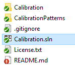
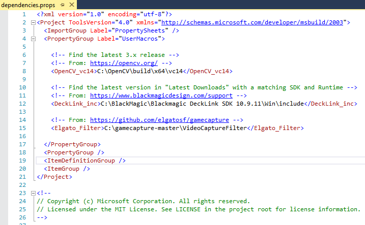

# README
## Overview
Calibrates the HoloLens to the external camera.  Uses a checkerboard pattern to find the rotation and translation from the HoloLens to the external camera.  A checkerboard pattern with a different number of columns to rows works best.  Additionally, the background color of the checkerboard should match the light squares of the board.

This process is critical to getting holograms believably grounded in your world.  A bad calibration will make any holograms that are supposed to be world-locked look wrong, and might render all holgrams at the wrong scale or position.  If you are using a very wide lens with a lot of distortion, consider distorting the hologram frame by the distortion coefficients and camera matrix that the calibration output gives you.  Be aware that wider lenses can be harder to calibrate since there is a greater area that needs to be covered with the calibration card and fewer points will overlap between the hololens camera and the external camera.

This application uses code in "..\Compositor\".  Please ensure that you have pulled this code and the original directory hierarchy is preserved.

**DISCLAIMER:** Do not point the camera directly at a light colored wall since OpenCV seems to have trouble detecting checkerboard patterns with this background and the app might run out of memory.

## Setup
Open the Calibration sln with Visual Studio under Calibration\Calibration.sln

### OpenCV 3.4.1
+ Download and install OpenCV 3.4.1 from [here](http://opencv.org/).
+ Extract OpenCV anywhere on your computer.
+ Update the OpenCV_vc14 user macro in dependencies.props with the corresponding path on your computer.
+ Restart Visual Studio if the Calibration or Compositor sln's are open.

### DeckLink Capture Card
If you are using a Blackmagic capture card, you will need to install the SDK and create a Visual Studio user macro for its location.
+ Download the DeckLink SDK from [here](https://www.blackmagicdesign.com/support) - Search for Desktop Video SDK in "Latest Downloads"
+ Extract the SDK anywhere on your computer.
+ Update the DeckLink_inc user macro in dependencies.props with the corresponding path on your computer.
+ Restart Visual Studio if the Calibration or Compositor sln's are open.

### Camera
+ Turn on your camera, set the camera to video mode, turn HDMI mirroring on, and turn on live view.
+ Pick a focal length that you want to record at.  Do not change the focal length during or after calibration.
+ Put your camera into full manual mode.
+ Increase the camera shutter speed and decrease the aperture size to get a sharp image without motion blur.
+ Set the ISO to some value that brightens the shot enough without adding too much noise.  Auto ISO will work, but restrict the maximum ISO so you do not introduce too much noise.  An appropriate maximum will be dependent on your camera's ISO performance.

Update your camera settings so your calibration pictures do not look like this:

### Checkerboard
For the best quality calibration, you will need a checkerboard mounted to a flat surface:
+ Print a black and white checkerboard image.  Fill an entire page.  Larger squares work best.
+ Get a white foam core board
+ Use spray adhesive to mount the checkerboard image to center of the foam core board.
+ Alternatively, get a large checkerboard pattern professionally printed in the center of a white board.
+ Ensure that you have a white border around the checkerboard pattern that is approximately the width of a square in the pattern.
+ The pattern we used has 2.66" squares at 300 DPI and is included in the CalibrationPatterns directory.
    + 2_66_grid_HALF.png can be printed on an 8.5x11" page.  Print two of these and mount them next to each other to complete the full board.
    + 2_66_grid_FULL.png is the full board and must be printed on a printer that supports larger pages.

### Code Changes
In stdafx.h in the Calibration project:
+ Change **HOLOLENS_USER** and **HOLOLENS_PW** to the credentials of your device's developer portal.
+ Change **CHESS_SQUARE_SIZE** to match the width (in meters) of the squares on the chessboard you are using to calibrate with.
+ Change **GRID_CELLS_X** and **GRID_CELLS_Y** to match the number of columns and rows (respectively) in your chessboard.

#### If you are shooting at a resolution other than 1080P:
In CompositorShared.h in the SharedHeaders project, change **FRAME_WIDTH** and **FRAME_HEIGHT** to match the resolution you are recording.

#### If your HoloLens is not plugged into your PC:
In stdafx.h in the Calibration project, change **HOLOLENS_ADDRESS** to L"https://%hololens_ip%/"

#### If you are using a different capture card that does not run on BlackMagic's DeckLink SDK:
+ First try using the OpenCV FrameProvider:
    + In CompositorShared.h in the SharedHeaders project, change **USE_OPENCV** to TRUE, change the other FrameProvider preprocessor definitions to FALSE.
    + In OpenCVFrameProvider.h, change **CAMERA_ID** to be the index of the capture device you are using.
+ If that did not work and your capture card has an SDK, use that:
    + Extend IFrameProvider and set the frameProvider in CalibrationApp.cpp to be your new IFrameProvider.
    + See DeckLinkManager.cpp for how we are doing this for the BlackMagic card.

## Application
+ When the application starts, you will see the view from your attached camera.
+ If you see a black screen: ensure your camera is on, lens cap is off, live view is on, and HDMI mirroring is on.
+ Any existing calibration files from a previous calibration will be automatically moved to "My Documents\OldCalibrationFiles\"
+ If a checkerboard with the expected grid dimension is in view, a picture will automatically be taken from the HoloLens' and camera's perspectives.
+ Move the checkerboard around the view.  Get pictures taken with the board in all parts of the view while the board is facing directly at the camera.
+ Repeat this process with the board tilted to the right, left, up, and down.
+ Do not rotate the board 90 degrees to the camera or the calibration system might report invalid results.
+ Repeat the process with the checkerboard closer and further away from the camera.
+ Press "Enter" with the Calibration app in focus to stop taking pictures and start calibrating the cameras with the pictures that were taken.
+ If you are running under a debugger, you will see the calibration progress in the output window.  The process will take a few minutes.
+ Once finished, navigate to "My Documents\CalibrationFiles\"
+ Open CalibrationData.txt to see your calibration.
+ The closer RMS is to 0, the better the calibration was.  If the value is too high, consider recalibrating.
+ Ensure that the DSLR and HoloLens RMS values are both close to 0.  Stereo calibration will probably be less accurate since the two cameras have different dimensions and focal lengths.
+ If you have a large stereo RMS value, look through the calibration pictures in "My Documents\CalibrationFiles\" to ensure that there are pictures with the calibration board at different orientations and distances in matching camera and hololens pictures.
+ When satisfied with your calibration, copy CalibrationData.txt to the "Assets" directory in your Unity project.

Calibration process should look like this.  For better results, you can also fill the view with the board and take a step backwards after each capture.

## Additional Documentation
+ [Overview](../README.md)
+ **Calibration**
+ [Compositor](../Compositor/README.md)
+ [SpectatorViewPoseProvider](../SpectatorViewPoseProvider/README.md)
+ [Sample](../SpectatorViewSample/README.md)