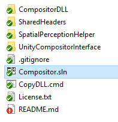
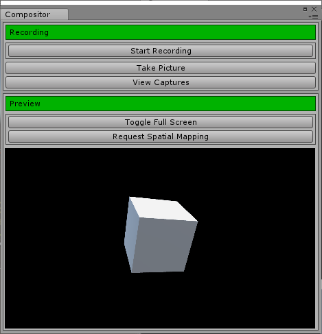

# README
## Overview
Spectator view renders holograms from Unity over a color frame from a capture card.  This uses the calibration data from the calibration app to render the holograms at the correct size and orientation.  

Use this app to take pictures and videos of your project.  Output pictures and videos will be saved to "My Documents\HologramCapture\".
The compositor runs as a Unity Editor Window when you have the spectator view addon in your project (see the sample project).

**DISCLAIMER:** Video recording is in alpha and you might experience some latency between hologram position in video to real-life.  Move the camera slower or target a stationary camera to mitigate this.

## Setup
Open the Compositor sln with Visual Studio under Compositor\Compositor.sln

### DeckLink Capture Card
If you are using a Blackmagic capture card, you will need to install the SDK and create a Visual Studio user macro for its location.
+ Download the DeckLink SDK from here: https://www.blackmagicdesign.com/support - Search for Desktop Video SDK in "Latest Downloads"
+ Extract the SDK anywhere on your computer.
+ Update the DeckLink_inc user macro in dependencies.props with the corresponding path on your computer.
+ Restart Visual Studio if the Calibration or Compositor sln's are open.

### OpenCV 3.2
If you are not using a capture card with an included FrameProvider, you will need to install Open CV to get color frames from a different capture device.
+ Download and install OpenCV 3.2 from here: http://opencv.org/downloads.html
+ Extract OpenCV anywhere on your computer.
+ Update the OpenCV_vc14 user macro in dependencies.props with the corresponding path on your computer.
+ Restart Visual Studio if the Calibration or Compositor sln's are open.

### Code Changes

#### If you are shooting at a resolution other than 1080P:
+ In CompositorShared.h in the SharedHeaders project, change **FRAME_WIDTH** and **FRAME_HEIGHT** to match the resolution you are recording.
+ Build UnityCompositorInterface for x64 and x86 and run CopyDLL.cmd
+ The DeckLinkManager will attempt to find the appropriate frame format based on your frame dimensions.  If your frame dimensions are not being picked up, you may need to modify the call to StartCapture in DeckLinkManager.cpp.

#### If you are using a different capture card that does not run on BlackMagic's DeckLink SDK:
+ First try using the OpenCV FrameProvider:
    + **NOTE:** This will require an x64 build of Unity unless you built your own x86 OpenCV 3.2 binaries
    + In CompositorShared.h in the SharedHeaders project, change **USE_OPENCV** to TRUE, change the other FrameProvider preprocessor definitions to FALSE.
    + In OpenCVFrameProvider.h, change **CAMERA_ID** to be the index of the capture device you are using.
+ If that did not work and your capture card has an SDK, use that:
    + Extend IFrameProvider and set the frameProvider in CompositorApp.cpp to be your new IFrameProvider.
    + See DeckLinkManager.cpp for how we are doing this for the BlackMagic card.
    
#### If you are using the Canon SDK:
+ Update the Canon_SDK user macro in dependencies.props with the corresponding path on your computer.
+ In CompositorShared.h in the SharedHeaders project, change **USE_CANON_SDK** to TRUE
+ In CompositorShared.h in the SharedHeaders project, change **HOLOGRAM_WIDTH** and **HOLOGRAM_HEIGHT** to match the photo dimensions from your camera.
+ Build UnityCompositorInterface for x64 and x86 and run CopyDLL.cmd

## Application
+ When you have made all of the above code changes, build the entire solution for Release x86 and Release x64 (depending on what Unity architecture you are using).
    + Ensure SpationPerceptionHelper is built for x86 since it will be run on the HoloLens.

+ Run CopyDLL.cmd to get the Compositor binaries and dependencies into your Unity project.
+ Load your Unity project.
+ Open the compositor in Unity's menu bar under "Spectator View/Compositor".
+ Press Play in Unity.
+ Ensure the Unity Game window is visible and "edit/ project settings/ player/ Run in Background" is checked for WSA and standalone.

    

+ See sample project for more details about instrumenting your Unity project for spectator view.

    

+ If you see a black screen: ensure your camera is on, lens cap is off, live view is on, and HDMI mirroring is on.
+ The spectator view Compositor window allows you to:
    + Start recording video
    + Take a picture
    + Change hologram opacity
    + Change the frame offset (which adjusts the color timestamp to account for capture card latency)
    + Open the directory the captures are saved to
    + Request spatial mapping data from the spectator view camera (if a SpatialMappingManager exists in your project)
    + Visualize the scene's composite view as well as color, holograms, and alpha channel individually.
+ If you take a picture or video, the file will be saved in "My Documents\HologramCapture\"
+ Holograms will not move with the camera until you follow the instructions in the sample project.
+ If you have followed all of the steps in the sample project: as you move the camera around, the composite image will show the holograms where they should be with respect to your HoloLens.

## Documentation
+ [Overview](../README.md)
+ [Calibration](../Calibration/README.md)
+ **Compositor**
+ [Sample](../Samples/README.md)