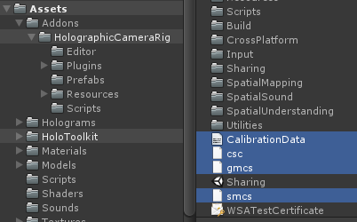

# README
## Overview
Sample Unity projects to demonstrate the end to end process of rendering an application's view over an external camera's color image.  These apps are shared experiences using one or more HoloLens devices and Unity as clients.
Look at the [Holograms 240](https://developer.microsoft.com/en-us/windows/holographic/holograms_240) course in the Holographic Academy to learn more about the core tech.

The apps have a directory "Assets\Addons\HolographicCameraRig" which, alongside HoloToolkit, includes everything you need for adding photo and video functionality to your own Unity app.

## Setup
+ Before launching Unity:
	+ Ensure CalibrationData.txt from your calibration has been copied to the root of your **Assets** directory.

	

	+ Build the UnityCompositorInterface and CompositorDLL in the Compositor sln (see Compositor Readme).
	+ Run CopyDLL to get compositor dependencies copied to your Unity project.
+ In the Unity Hierarchy Panel, Under the **SpectatorViewManager** prefab:
    + Set the **Sharing Service IP** to be your local IPv4 address.  You can get this by typing ipconfig in a cmd prompt.
    + Set the **Spectator View IP** to be the IP of the HoloLens attached to your camera.
	
	
	
+ Walk around your playspace with all of the HoloLens devices that will be in the experience, so each device has an internal model of the space that it is in.
+ Build and Deploy:
    + Start the HoloToolkit sharing service under **HoloToolkit\Launch Sharing Service**.
	
	
	
    + Build the application as a D3D UWP
    + Deploy the app to the HoloLens attached to your camera.
    + Deploy the app to any other HoloLens devices you want to see the experience.
+ Press **Play** in Unity to get realtime Hologram frames for the Compositor.
+ Open the Compositor in the Unity menu bar under "Spectator View\Compositor".

	

+ Ensure the Unity Game window is visible and "edit/ project settings/ player/ Run in Background" is checked for WSA and standalone.

	

## Adding spectator view support to your app
Since you are using the HoloToolkit sharing service, you must use the old Spectator View Manager code which can be found [here](https://github.com/Microsoft/MixedRealityCompanionKit/tree/1.5.7.0/SpectatorView/Samples/SharedHolograms/Assets). This sample project has been set up as a shared experience, but if you would like to add this functionality to your existing app, or would like to start from a new project, follow these instructions:

+ Copy **Assets\Addons\HolographicCameraRig** to **Assets\Addons\** in your project.
+ Download the latest [HoloToolkit](https://github.com/Microsoft/HoloToolkit-Unity) and add it to your project.
+ Add **Assets\Addons\HolographicCameraRig\Prefabs\SpectatorViewManager** to the root of your hierarchy.
+ Copy **CalibrationData.txt**, **csc.rsp**, **gmcs.rsp**, and **smcs.rsp** to your Assets directory.
+ Populate the GameObject fields in SpectatorViewManager with your desired prefabs (or leave with the defaults)
+ Populate the IP fields in SpectatorViewManager with the IP of your spectator view HoloLens and PC running your sharing service.
+ If you have multiple spectator view rigs attached to multiple PC's, specify which PC you are connecting to with the Local Computer IP field.

+ If your scene has any GameObjects you would not like in your photos or videos, add them to **Objects To Hide In Picture** in **Anchor\SceneManager**
+ Any scene elements that you want to record should be children of Anchor\SceneManager.
    + (SceneManager has a custom network message to transform all child game objects in all clients if the transform changes in Unity.)

+ **DISCLAIMER:** Any interactions with the app will have to be networked events from your client HoloLens devices back to Unity.
    + If any app state in the device does not get updated in Unity, it will not appear in the Compositor.
    + Look at CustomMessages.cs or follow the [Holograms 240](https://developer.microsoft.com/en-us/windows/holographic/holograms_240) course to learn more about the programming model.
    
+ **DISCLAIMER:** If your app was already a shared experience (Like the SharedHolograms sample), you might already have an Anchor and Sharing prefab in your scene.  The Sharing prefab does not need to be replaced, but the scripts on Anchor (under Assets\Addons\HolographicCameraRig\Scripts) will have to be added to your existing Anchor.  
    + ImportExportAnchorManager.cs should not be included twice, and might cause incorrect bahavior if it is.
    + If you have more than 50 CustomMessages in your existing Unity app, you will also need to increase the offset for messageStartIndex in "Assets\Addons\HolographicCameraRig\Scripts\CustomMessages.cs"

+ **DISCLAIMER:** If you already have an Anchor, Sharing, or HolographicCameraManager prefab in your scene, these will be defaulted to over the ones in SpectatorViewManager.  **However** if the IPs on those prefabs do not match the IPs in SpectatorViewManager, they will be recreated with the prefabs from SpectatorViewManager.
	
	
## Documentation
+ [Overview](../README.md)
+ [Calibration](../Calibration/README.md)
+ [Compositor](../Compositor/README.md)
+ **Sample**
