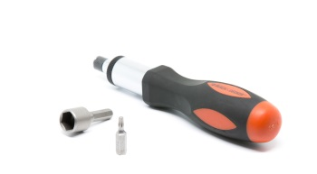
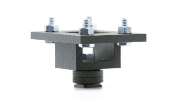

# README

## Overview
Spectator view uses an external camera rigidly mounted to a HoloLens to take high definition pictures and video of your holographic Unity project. Unlike Mixed Reality Capture (MRC),  the Spectator View project allows for high resolution captures from a third person perspective   Use this project to capture higher resolution and higher quality pictures for your store submissions, marketing videos, or for projecting a live view for all spectators to see.

**DISCLAIMER:** Video recording is in alpha and you might experience some latency between hologram position in video to real-life.  Move the camera slower or target a stationary camera to mitigate this.

## Material List
Note: The linked materials are not the only materials that will work, but are the ones that we used.
Make sure the materials you get are compatible with your existing camera.
+ Camera with HDMI out and configurable output overlays.
    + See below for tested cameras.
+ Capture Card
    + See below for tested capture cards.
+ [HDMI to Mini HDMI cable](http://www.amazon.com/AmazonBasics-High-Speed-Mini-HDMI-HDMI-Cable/dp/B014I8UHXE?ie=UTF8&psc=1&redirect=true&ref_=oh_aui_detailpage_o03_s00) (or whatever HDMI form your camera supports)
+ Bracket to connect your HoloLens to a camera: Hardware\HoloLens_Mount.stp.
    + We recommend this to be professionally machined in aluminum: 3D printing might not achieve adequate tolerances to hold the device.
        + Search for machine shops in your area to get this bracket machined.
    + You do not have to use this bracket: Any means of rigidly attaching your HoloLens to your camera will work.
+ If using the above mount:
    + Adapter to connect the HoloLens mount to a DSLR hotshoe: Hardware\Mount_Adapter.stl.  This file can be 3D printed.  Holes were measured against the below bolts, you might need to alter the dimensions if using other bolts.
    + [Hotshoe Fastener](https://www.amazon.com/Fotasy-SCX2-Adapter-Premier-Cleaning/dp/B00HPAPFNU/ref=redir_mobile_desktop?ie=UTF8&psc=1&ref_=yo_ii_img)
    + [1/4-20" x 3/4" Bolts](https://www.amazon.com/Hard-Find-Fastener-014973100032-4-20-Inch/dp/B004S6RZPK/ref=redir_mobile_desktop?ie=UTF8&psc=1&ref_=yo_ii_img)
    + [1/4-20" Nuts](https://www.amazon.com/Hillman-Group-150003-20-Inch-100-Pack/dp/B000BPEPNW/ref=redir_mobile_desktop?ie=UTF8&psc=1&ref_=yo_ii_img)
    + Screw driver with the following heads (These links are examples, many screwdriver sets will have these attachments) :
        + [7/16 Nut Driver](https://www.amazon.com/Klein-Tools-630-7-Cushion-Grip-Hollow-Shank/dp/B000BPG4CW/ref=sr_1_1?ie=UTF8&qid=1479853212&sr=8-1&keywords=7%2F16+nut+driver)
        + [T15 Torx](https://www.amazon.com/Stanley-60-011-Standard-Torx-Screwdriver/dp/B000KFXDWW/ref=sr_1_1?ie=UTF8&qid=1479853303&sr=8-1&keywords=15+torx)
        + [T7 Torx](https://www.amazon.com/SE-7542ST-6-Piece-Professional-Screwdriver/dp/B000ST3K3W/ref=sr_1_1?ie=UTF8&qid=1479853479&sr=8-1&keywords=torx+7)

## Software
+ [Blackmagic Capture Card SDK](https://www.blackmagicdesign.com/support)
    + Search for Desktop Video SDK in "Latest Downloads"
    + If using a BlackMagic DeckLink card.
+ [Blackmagic Desktop Video Runtime](https://www.blackmagicdesign.com/support)
    + Search for Desktop Video Update in "Latest Downloads"
    + Version number must match the Capture Card SDK.
    + If using a BlackMagic DeckLink card.
+ [Elgato Game Capture HD](https://www.elgato.com/en/gaming/beta)
    + If using an Elgato capture card.
+ [Elgato Filters](https://github.com/elgatosf/gamecapture)
    + If using an Elgato capture card.
+ [OpenCV 3.1](http://opencv.org/downloads.html)
    + Download and install OpenCV **3.1**
+ [Canon SDK](https://www.usa.canon.com/internet/portal/us/home/explore/solutions-services/digital-camera-sdk-information) (Optional)
    + If you are using a Canon camera and have access to the Canon EDSDK, you can tether your camera to your PC to take higher resolution images.
+ [Unity3D](https://unity3d.com/unity/beta/)
+ [Visual Studio 2015 Update 3](https://developer.microsoft.com/en-us/windows/downloads)
    
    
## Dependencies
The following dependencies require a manual download and a Visual Studio user macro.

### OpenCV 3.1
+ Download and install OpenCV **3.1** from [here](http://opencv.org/downloads.html).
+ Extract OpenCV anywhere on your computer.
+ Update the OpenCV_vc14 user macro in dependencies.props with the corresponding path on your computer.
+ Restart Visual Studio if the Calibration or Compositor sln's are open.

### DeckLink Capture Card
+ Download the DeckLink SDK from [here](https://www.blackmagicdesign.com/support).
    + Search for Desktop Video SDK in "Latest Downloads"
+ Extract the SDK anywhere on your computer.
+ Update the DeckLink_inc user macro in dependencies.props with the corresponding path on your computer.
+ Restart Visual Studio if the Calibration or Compositor sln's are open.

### Elgato Capture Card
+ Download the Elgato DirectShow filter headers from [here](https://github.com/elgatosf/gamecapture).
+ Clone or extract anywhere on your computer.
+ Update the Elgato_Filter user macro in dependencies.props with the corresponding path on your computer.
+ Restart Visual Studio if the Calibration or Compositor sln's are open.

### Canon SDK (Optional)
+ Request access to the Canon SDK from [here](https://www.usa.canon.com/internet/portal/us/home/explore/solutions-services/digital-camera-sdk-information).
+ Extract anywhere on your computer.
+ Update the Canon_SDK user macro in dependencies.props with the corresponding path on your computer.
+ **NOTE:** When targetting x64 Unity, use EDSDK_64.  When targetting x86 Unity, use EDSDK.
+ Restart Visual Studio if the Calibration or Compositor sln's are open.

## Included Projects
Each project has its own README with additional overview and setup instructions.  See Documentation links below.
### Calibration
Calibrates the HoloLens to the external camera.  Uses a checkerboard pattern to find the rotation and translation from the HoloLens to the external camera.  This process also finds the vertical field of view of the attached camera so holograms can be rendered at the correct projection to the camera.
### Compositor
Unity Editor window that renders holograms from Unity over a color frame from a capture card.  Outputs photo and video of the scene.  This must be built and copied to your Unity project using CopyDLL.cmd.
### Samples\SharedHolograms
Sample demonstrating how to add the HolographicCameraRig to an app that is already a shared experience.  In this case, it is the Holographic Academy [Holograms 240](https://developer.microsoft.com/en-us/windows/holographic/holograms_240) course.
### CopyDLL.cmd
If you have changed any #define in CompositorShared.h, run this cmd to copy DLL's that depend on those definitions to your Unity projects.  Include the Assets path to your own project to copy there.

## Camera Setup
If using a camera with a capture card, you must configure the camera to output correctly:
+ Change your camera to Video Mode.  This will allow the output image to fill the whole buffer, rather than letterboxing to the picture aspect ratio.
+ Find your camera's HDMI settings - enable "dual monitor" or "mirroring".
+ Set the resolution to 1080P
+ Turn off "Live view on screen display" so any screen overlays on the live view are not shown in the composite.
+ Turn on your camera's live view.
+ If using the Canon SDK and would like to use a flash unit, disable "Silent LV Shoot"
+ Plug an hdmi cable from the camera's hdmi port to the hdmi in port of the capture card.
    + This is the outer port on the Blackmagic capture card.
+ Optionally plug an hdmi cable from the hdmi out port to a television or preview monitor.
    + This is the center port on the Blackmagic capture card.

Note: if you would like to capture images or video at a resolution other than 1080P (eg: Photo Mode, 720P, or 4K) there will be a small code change mentioned in the individual projects' README's.

## Spectator View Rig Setup
This section assumes you are using the included HoloLens bracket.  Alternative mounting techniques can be used instead.

+ Use a T7 screwdriver to remove the headband from the HoloLens.
    + Once screws are loose, poke them out with a paperclip from the other side.
+ Remove the screw cap on the inside front of the HoloLens visor, you can do this with a small flat head screwdriver.

+ Use a T15 screwdriver to remove the small torx bolts from the HoloLens bracket to remove the U and Hook-shaped attachments.
+ Place the HoloLens on the bracket, lining up the exposed hole on the inside of the visor with the extrusion on the front of the bracket.
    + HoloLens arms should be kept in place by the pins on the bottom of the bracket.
+ Reattach the U and Hook-shaped attachments to secure the HoloLens to the bracket.

+ Attach the hotshoe fastener to the hotshoe of your camera.
+ Attach the mount adapter to the hotshoe fastener.

+ Rotate the adapter so the narrow side is facing forward and parallel to the camera's lens.
+ Secure the adapter in place with a 1/4" nut using the 7/16 nut driver.
+ Position the bracket against the adapter so the front of the HoloLens' visor is as close as possible to the front of the camera's lens.
+ Attach the bracket with 4 1/4" nuts and bolts using the 7/16 nut driver.

## Recommended PC Specs
Any PC that can run the HoloLens emulator can run spectator view.

## Tested Cameras
+ [Canon 5D Mark III](https://www.amazon.com/Canon-Frame-Full-HD-Digital-Camera/dp/B007FGYZFI/ref=sr_1_3?s=photo&ie=UTF8&qid=1480537693&sr=1-3&keywords=Canon+5D+Mark+III)
+ [Nikon D7200](https://www.amazon.com/Nikon-D7200-DX-format-DSLR-Black/dp/B00U2W45WA/ref=sr_1_1?s=photo&ie=UTF8&qid=1480537720&sr=1-1&keywords=Nikon+D7200)
+ [GoPro Hero 4 Black](https://www.amazon.com/GoPro-CHDHX-401-HERO4-BLACK/dp/B00NIYNUF2/ref=sr_1_1?s=photo&ie=UTF8&qid=1480537753&sr=1-1&keywords=GoPro+Hero+4+black)
+ [Blackmagic Design Production Camera 4K](https://www.amazon.com/Blackmagic-Design-Production-Camera-Mount/dp/B00CWLSHYG/ref=sr_1_1?s=photo&ie=UTF8&qid=1480537790&sr=1-1&keywords=blackmagic+design+production+camera+4k) with [SDI to HDMI converter](https://www.amazon.com/Blackmagic-Design-Micro-Converter-SDI-HDMI/dp/B01EIOW9TI/ref=sr_1_1?ie=UTF8&qid=1480537848&sr=8-1&keywords=blackmagic+sdi+to+hdmi)

## Tested Capture Cards
+ [Blackmagic Intensity Pro 4K](http://www.amazon.com/Blackmagic-Design-Intensity-Capture-Playback/dp/B00U3QNP7Q/ref=sr_1_fkmr2_1?ie=UTF8&qid=1463682487&sr=8-1-fkmr2&keywords=Blackmagic+Design+Intensity+Pro+4K+Capture+and+play+back+Cards+BINTSPRO4K)
+ [Blackmagic Intensity Shuttle USB 3](https://www.amazon.com/Blackmagic-Design-Intensity-Shuttle-BINTSSHU/dp/B003WSQTWU/ref=sr_1_6?s=electronics&ie=UTF8&qid=1487205313&sr=1-6&keywords=blackmagic)
    + Does not work on all PCs - see Blackmagic documentation for their tested hardware.
    + Only supports HDMI in from camera (no HDMI out to an external display).
+ [Elgato HD 60S](https://www.amazon.com/Elgato-Game-Capture-HD60-technology/dp/B01DRWCOGA/ref=sr_1_1?s=electronics&ie=UTF8&qid=1487205387&sr=1-1&keywords=elgato+60S)
    + Only supports HDMI in from camera (no HDMI out to an external display).

**NOTE:** The default capture card will be a blackmagic capture card, if using a different card, you will need to update **Compositor\SharedHeaders\CompositorShared.h**:
+ USE_DECKLINK is TRUE if using a Blackmagic card.
+ USE_ELGATO is TRUE if using an Elgato card.
+ USE_OPENCV is TRUE to fallback to any other camera.

Each capture card has required software dependencies including runtimes and SDK's. See the **Software** section above.

##Documentation
+ **Overview**
+ [Calibration](Calibration/README.md)
+ [Compositor](Compositor/README.md)
+ [Sample](Samples/README.md)
