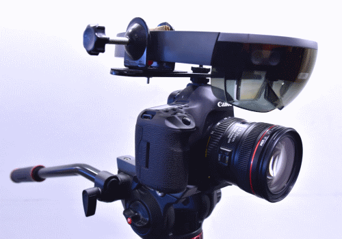

# README

Spectator view has been updated to use a standalone application *SpectatorViewPoseProvider* on the spectator view HoloLens rather than building the Unity game for that HoloLens as was done in previous versions.
This allows for a more direct communication between the spectator view HoloLens and compositor, and reduces iteration time since this application can be built and deployed once to the spectator view device.

**Find older versions of spectator view [here](../LegacySpectatorView/README.md).**

## Overview
Spectator view uses an external camera rigidly mounted to a HoloLens to take high definition pictures and video of your holographic Unity project. Unlike Mixed Reality Capture (MRC),  the Spectator View project allows for high resolution captures from a third person perspective   Use this project to capture higher resolution and higher quality pictures for your store submissions, marketing videos, or for projecting a live view for all spectators to see.

## Quick Start
+ Install [prerequisite software](#software).
    + Visual Studio
    + Unity Game Engine
    + Dependencies for your capture card.
    + Update [dependencies.props](#dependencies) with install paths to this prerequisite software.
+ Build the [included projects](#included-projects).
    + Update [CompositorConstants.h](./Compositor/SharedHeaders/CompositorConstants.h) with your capture card type.  Set the FrameProvider type that matches your capture card to TRUE.
+ [Copy the Compositor DLLs](./Compositor/CopyDLL.cmd) to your Unity project.
    + This only needs to be done once unless you make changes to the Compositor DLL or start a new project.
    + Unity must be closed, or the copy will fail.
+ Set up your [camera](#camera-setup).
+ Set up your [network](#network-setup).
+ Deploy and run SpectatorViewPoseProvider on your spectator view HoloLens.
+ Launch the [Sample Unity Project](./SpectatorViewSample/README.md).
+ Update the **Server IP** and **Spectator View IP** fields in the **SharingToSVAdapter** GameObject in the project hierarchy.
    + **Server IP** should be your **local PC**'s IPv4 address.
    + **Spectator View IP** should be the **spectator view HoloLens device**'s IPv4 address.
+ Open the **Compositor** Window from the Unity toolbar under **"Spectator View/ Compositor"**.
+ Press Play in Unity and move the spectator view camera around.
    + Once a connection has been established, you should see the holograms moving with your camera.
+ [Build and deploy](https://docs.microsoft.com/en-us/windows/mixed-reality/holograms-100#chapter-6---build-and-deploy-to-device-from-visual-studio) the Unity project to a second HoloLens.
+ Launch the sample application on the second HoloLens.
    + Be sure to face a similar direction to the spectator view HoloLens so the two devices have an easier time localizing their spaces to each other.
+ Once a connection has been made:
    + **Anchor Owner IP** will populate in **SharingToSVAdapter** and **SpectatorViewManager**.
    + When the spectator view HoloLens has localized the anchor the second HoloLens shared with it, the spectator view's perspective will change in the Unity editor and any holograms relative to the anchor will be in the same spot on all devices.
    + Move the spectator view device around, and you should see a cube on the second HoloLens and a shared cube where the anchor is.
+ Once you can run the sample application:
    + [Calibrate](./Calibration/README.md) your spectator view rig.
    + [Add spectator view to your own project](#adding-spectator-view-support-to-your-unity-app).

## Frequently Asked Questions (FAQs)
### Holograms are not where they should be
+ This usually means there is a a problem with the anchor.  It is possibly not created, not shared, or not localized.
    + Check that you have a valid **Anchor Owner IP** in your SpectatorViewManager prefab.
    + Check that you have a valid **Object To Anchor** in your Sharing prefab.
    + Check that the SpectatorViewManager prefab is a child of the anchor object.
    + Attach a debugger to the SpectatorViewPoseProvider and see if there is any debug information being printed that it cannot localize the new anchor.  If so:
        + If your space does not have any recognizable patterns or surfaces, you may need to add some visual elements to your space to help the HoloLens devices localize.
        + Walk around your space with both HoloLens devices, looking up, down, left, and right.
        + Relaunch the sample application on your second HoloLens while looking in the same direction as the spectator view device.
+ If holograms are transformed or rotated a little bit or appear larger or smaller than your space, it is probably a problem with your rig's [calibration](./Calibration/README.md).  In this case, the offset of the HoloLens to the camera, or the field of view of your camera may be innacurate.  The spectator view calibration also assumes the HoloLens is attached above the camera.  If you have a different configuration, find the Calibration script on the SpectatorViewCamera object in your SpectatorViewManager prefab and select the Rotate Calibration checkbox.

### Holograms stay locked to the camera
+ Check that SpectatorViewPoseProvider is running and active on your spectator view HoloLens.  You should see a wireframe visualization of the spatial mapping mesh on this device.  If you don't see anything or see the home screen, the app is running in the background and will not be sending poses.
+ Check that the SpectatorViewHoloLensIP is set correctly in your SpectatorViewManager when Unity is running.
+ Check that you have correctly [set up your network](#network-setup) to allow your HoloLens devices to connect to Unity.

### Holograms appear to swim
+ Try resetting the pose cache.  While Unity is running, find the SpectatorViewManager in the Hierarchy, and select the "Reset Hologram Synchronization" checkbox, or press the "Request Spatial Mapping" button in the compositor.
+ The Frame offset may be wrong.  Spectator view is not able to get a true color frame time because there is some latency between the camera shutter and the capture card's capture which is different depending on your camera and capture card.  We only get a timestamp for the capture time.  To get an approximation of the shutter time, we use a frame offset slider on the SpectatorViewManager prefab.  This value may be known from the capture card manufacturer, but more likely will need to be found through estimation.  If you load spatial mapping data in the compositor, you will have a hologram that should match your surfaces directly and can use the following guidelines to find the best frame offset:
    + If the **hologram moves earlier** than the color frame, use a **higher frame offset**.
    + If the **color frame moves earlier** than the hologram frame, use a **lower frame offset**.
    + When you find a frame offset that works for you, make sure you set it in your SpectatorViewManager prefab while Unity is not in play more.
+ Restart the spectator view HoloLens.

### Frozen color frame
Unplug the camera's HDMI cable and plug it back in again.

### Green, Black, or Blue color frame
+ Check that you have updated the [compositor]((./Compositor/SharedHeaders/CompositorConstants.h) to look for your capture card.
+ Check that your camera is on and plugged in.
+ Check that your camera is outputting HDMI, you can plug it directly into a monitor or use your capture card's software to preview.
+ Check that the output resolution of your camera is the same as the expected resolution in [CompositorConstants.h](./Compositor/SharedHeaders/CompositorConstants.h).
+ Check that you have correctly [set up your camera](#camera-setup).
+ Check that you have no other software using your capture card's runtime.
+ Check that you have removed your camera's lens cap.

### Spatial mapping has old data.
When the SpectatorViewPoseProvider application first starts, spatial mapping will be live for 10 seconds before everything is cached.  Whenever you request spatial mapping in the compositor, spatial mapping will start getting live data for another 10 seconds.  If you have a spot on your mesh you need to update, point your spectator view device in that direction and press the request spatial mapping button a few times. 

## Adding Spectator View Support to Your Unity App
+ Import the latest **SpectatorView UnityPackage** from the companion kit [releases](https://github.com/Microsoft/MixedRealityCompanionKit/releases).
+ Add **Addons\SpectatorViewRig\Prefabs\SpectatorViewManager** to the root of your project hierarchy.
+ Add networking support to your Unity app to make it a shared experience.  Some options:
    + Import the Sharing UnityPackage from the same release as above, then add **Sharing\Prefabs\Sharing** to the root of your hierarchy.  Follow [instructions](SpectatorViewSample/README.md) to setup your shared experience.
    + https://docs.microsoft.com/en-us/windows/mixed-reality/mixed-reality-250
+ Modify SharingToSVAdapter to integrate spectator view with your chosen network stack.
+ **NOTE:** *SpectatorViewPoseProvider* assumes that an **anchor is being shared on a known IP and port**.  If your network solution does something different, you will need to modify the [ConnectToServer](SpectatorViewPoseProvider/SpectatorViewPoseProvider/AnchorImporter.cpp) function in SpectatorViewPoseProvider or the [ConnectToAnchorOwner](SpectatorViewPoseProvider/SpectatorViewPoseProvider/SpectatorViewPoseProviderMain.cpp) function in SpectatorViewPoseProviderMain.cpp.
+ Update the IP, Port, and GameObject fields in your **SpectatorViewManager** and **Sharing** prefabs.
+ Use your chosen networking stack to **share application state** from your HoloLens to the Unity compositor.  This may include:
    + Serializing and deserializing data over a [socket].(SpectatorViewSample/Assets/Sharing/Scripts/NetworkData.cs)
    + Using a [SyncVar](https://docs.unity3d.com/Manual/UNetStateSync.html) with [UNET](https://docs.unity3d.com/Manual/UNet.html).

## Material List
Note: The linked materials are not the only materials that will work, but are the ones that we used.
Make sure the materials you get are compatible with your existing camera.
+ Camera with HDMI out and configurable output overlays.
    + See below for tested cameras.
+ Capture Card
    + See below for tested capture cards.
+ [HDMI to Mini HDMI cable](http://www.amazon.com/AmazonBasics-High-Speed-Mini-HDMI-HDMI-Cable/dp/B014I8UHXE?ie=UTF8&psc=1&redirect=true&ref_=oh_aui_detailpage_o03_s00) (or whatever HDMI form your camera supports)
+ Bracket to connect your HoloLens to a camera: Hardware\HoloLens_Mount.stp.
    + We recommend this to be professionally machined in aluminum: 3D printing might not achieve adequate tolerances to hold the device.
        + Search for machine shops in your area to get this bracket machined.
    + You do not have to use this bracket: Any means of rigidly attaching your HoloLens to your camera will work.
+ If using the above mount:
    + Adapter to connect the HoloLens mount to a DSLR hotshoe: Hardware\Mount_Adapter.stl.  This file can be 3D printed.  Holes were measured against the below bolts, you might need to alter the dimensions if using other bolts.
    + [Hotshoe Fastener](https://www.amazon.com/Fotasy-SCX2-Adapter-Premier-Cleaning/dp/B00HPAPFNU/ref=redir_mobile_desktop?ie=UTF8&psc=1&ref_=yo_ii_img)
    + [1/4-20" x 3/4" Bolts](https://www.amazon.com/Hard-Find-Fastener-014973100032-4-20-Inch/dp/B004S6RZPK/ref=redir_mobile_desktop?ie=UTF8&psc=1&ref_=yo_ii_img)
    + [1/4-20" Nuts](https://www.amazon.com/Hillman-Group-150003-20-Inch-100-Pack/dp/B000BPEPNW/ref=redir_mobile_desktop?ie=UTF8&psc=1&ref_=yo_ii_img)
    + Screw driver with the following heads (These links are examples, many screwdriver sets will have these attachments) :
        + [7/16 Nut Driver](https://www.amazon.com/Klein-Tools-630-7-Cushion-Grip-Hollow-Shank/dp/B000BPG4CW/ref=sr_1_1?ie=UTF8&qid=1479853212&sr=8-1&keywords=7%2F16+nut+driver)
        + [T15 Torx](https://www.amazon.com/Stanley-60-011-Standard-Torx-Screwdriver/dp/B000KFXDWW/ref=sr_1_1?ie=UTF8&qid=1479853303&sr=8-1&keywords=15+torx)
        + [T7 Torx](https://www.amazon.com/SE-7542ST-6-Piece-Professional-Screwdriver/dp/B000ST3K3W/ref=sr_1_1?ie=UTF8&qid=1479853479&sr=8-1&keywords=torx+7)
+ [Router](https://www.amazon.com/D-Link-Tri-Band-Performance-Beamforming-DIR-890L/dp/B00PVD81MK/ref=sr_1_3?ie=UTF8&qid=1496459664&sr=8-3)
    + This is necessary if your networking stack requires UDP broadcast, but your local network does not support it.
        

## Software
+ If using a **BlackMagic DeckLink** capture card:
    + [Blackmagic Capture Card SDK](https://www.blackmagicdesign.com/support)
        + Search for Desktop Video SDK in "Latest Downloads"
    + [Blackmagic Desktop Video Runtime](https://www.blackmagicdesign.com/support)
        + Search for Desktop Video Update in "Latest Downloads"
        + Version number must match the Capture Card SDK.
+ If using an **Elgato** capture card:
    + [Elgato Game Capture HD](https://www.elgato.com/en/gaming/beta)
    + [Elgato Filters](https://github.com/elgatosf/gamecapture)
+ [OpenCV 3.4.1](https://opencv.org/releases.html)
    + Download and install OpenCV **3.4.1**
    + If using a different version of OpenCV, update the **#pragma comment(lib, "%LIB_NAME")** in [OpenCVFrameProvider.h](./Compositor/CompositorDLL/OpenCVFrameProvider.h) and [CalibrationApp.h](./Calibration/Calibration/CalibrationApp.h) to reference the updated lib number.
    + Do **not** use OpenCV 2.x.
+ [Unity3D](https://unity3d.com/)
+ [Visual Studio 2017](https://developer.microsoft.com/en-us/windows/downloads)
    + Note: Visual Studio 2015 may also be used, but the solutions will need to be rolled back to v140 and you will need to target an earlier UWP SDK (such as 10586 or 14393)
    + Ensure you have the following VS2017 Workloads installed: 
        1. **Universal Windows Platform development** 
        2. **Desktop development with C++** 
        3. **Game development with C++**
+ [Windows Media Feature Pack](https://www.microsoft.com/en-us/download/details.aspx?id=48231)
    + Only required for Windows **N** or **KN** editions.

## Dependencies
The following dependencies require a manual download and a Visual Studio user macro.

### OpenCV 3.4.1
+ Download and install OpenCV **3.4.1** from [here](http://opencv.org/releases.html).
+ Extract OpenCV anywhere on your computer.
+ Update the OpenCV_vc14 user macro in dependencies.props with the corresponding path on your computer.
+ Restart Visual Studio if the Calibration or Compositor sln's are open.

### DeckLink Capture Card
+ Download the DeckLink SDK from [here](https://www.blackmagicdesign.com/support).
    + Search for Desktop Video SDK in "Latest Downloads"
+ Extract the SDK anywhere on your computer.
+ Update the DeckLink_inc user macro in dependencies.props with the corresponding path on your computer.
+ Restart Visual Studio if the Calibration or Compositor sln's are open.

### Elgato Capture Card
+ Download the Elgato DirectShow filter headers from [here](https://github.com/elgatosf/gamecapture).
+ Clone or extract anywhere on your computer.
+ Update the Elgato_Filter user macro in dependencies.props with the corresponding path on your computer.
+ Restart Visual Studio if the Calibration or Compositor sln's are open.

## Included Projects
Each project has its own README with additional overview and setup instructions.  See [Additional Documentation](#additional-documentation) links below.

### Calibration
Calibrates the HoloLens to the external camera.  Uses a checkerboard pattern to find the rotation and translation from the HoloLens to the external camera.  This process also finds the vertical field of view of the attached camera so holograms can be rendered at the correct projection to the camera.

### SpectatorViewPoseProvider
Application that runs on the spectator view HoloLens to provide pose data to the Unity compositor.

### Compositor
DLL that synchronizes HoloLens poses to camera frames and manages textures for previewing and recording.  This must be built and copied to your Unity project using CopyDLL.cmd.

### SpectatorViewSample
Simple networked sample demonstrating spectator view usage.

### CopyDLL.cmd
If you have changed any #define in CompositorConstants.h, rebuild the compositor and run this cmd to copy DLL's that depend on those definitions to the sample Unity project.  Include the Assets path to your own project to copy there too.

## Camera Setup
If using a camera with a capture card, you must configure the camera to output correctly:
+ Change your camera to Video Mode.  This will allow the output image to fill the whole buffer, rather than letterboxing to the picture aspect ratio.
+ Find your camera's HDMI settings - enable "dual monitor" or "mirroring".
+ Set the resolution to 1080P
+ Turn off "Live view on screen display" so any screen overlays on the live view are not shown in the capture.
+ Turn on your camera's live view.
+ Plug an hdmi cable from the camera's hdmi port to the hdmi in port of the capture card.
    + This is the outer port on the Blackmagic capture card.
+ Optionally plug an hdmi cable from the hdmi out port to a television or preview monitor.
    + This is the center port on the Blackmagic capture card.

Note: if you would like to capture images or video at a resolution other than 1080P (eg: Photo Mode, 720P, or 4K) update CompositorConstants.h to match the new resolution.

## Network Setup
+ Some networking stacks require UDP broadcast to be enabled on your network.
    + If you are on a corporate network that does not have this enabled, you may need to use a [router](https://www.amazon.com/D-Link-Tri-Band-Performance-Beamforming-DIR-890L/dp/B00PVD81MK/ref=sr_1_3?ie=UTF8&qid=1496459664&sr=8-3)
    + Plug an ethernet cable from your PC into the router.
    + Connect your HoloLens devices to this router.
    + The included sample networking stack does not use UDP broadcast, but UNET does.
+ Ensure your HoloLens devices and Unity can talk to each other by opening up UDP and TCP communication to Unity in your firewall settings.
    + Open the **Control Panel**.
    + Select **System and Security**.
    + Select **Windows Defender Firewall**.
    + Select **Advanced Settings** on the left.
    + Select **Inbound Rules** on the left.
    + Find **Unity Editor** or **Unity %VERSION% Editor** and ensure the **Program** path is the version of Unity you are using.
    + Double click on the Unity Editor line with the **UDP** protocol.
        + This may also be listed as **Any**
    + Select **Allow the connection**.
    + Select **Advanced**.
    + Select the **profiles** that will work for your network.  (At least **Private** must be checked when using a router.  Domain and/or Public may be needed if on a wider network.)
    + Select **Apply**.
    + Repeat for the **TCP** protocol.
+ Since new Unity installs overwrite the same directory, firewall settings must be changed for all versions of Unity in the list with the same Program path, or you can remove older entries from the list.
    + When you update Unity, you must go through this process again.
    + If **any** of the entries that point to your Unity install directory block network traffic, traffic will be blocked.

## Spectator View Rig Setup
This section assumes you are using the included HoloLens bracket.  Alternative mounting techniques can be used instead.

+ Use a T7 screwdriver to remove the headband from the HoloLens.
    + Once screws are loose, poke them out with a paperclip from the other side.
+ Remove the screw cap on the inside front of the HoloLens visor, you can do this with a small flat head screwdriver.

+ Use a T15 screwdriver to remove the small torx bolts from the HoloLens bracket to remove the U and Hook-shaped attachments.
+ Place the HoloLens on the bracket, lining up the exposed hole on the inside of the visor with the extrusion on the front of the bracket.
    + HoloLens arms should be kept in place by the pins on the bottom of the bracket.
+ Reattach the U and Hook-shaped attachments to secure the HoloLens to the bracket.

+ Attach the hotshoe fastener to the hotshoe of your camera.
+ Attach the mount adapter to the hotshoe fastener.

+ Rotate the adapter so the narrow side is facing forward and parallel to the camera's lens.
+ Secure the adapter in place with a 1/4" nut using the 7/16 nut driver.
+ Position the bracket against the adapter so the front of the HoloLens' visor is as close as possible to the front of the camera's lens.
+ Attach the bracket with 4 1/4" nuts and bolts using the 7/16 nut driver.

## Alternate Spectator View Rig Setup
The spectator view rig assembly can be made without any custom hardware.

### Material List
+ [1 Hotshoe Fastener](https://www.amazon.com/gp/product/B00HPAPFNU/ref=oh_aui_detailpage_o03_s01?ie=UTF8&psc=1)
+ [1 Dual Flash Bracket](https://www.amazon.com/gp/product/B01LZKI0BQ/ref=oh_aui_detailpage_o03_s01?ie=UTF8&psc=1)
+ [1 Washer](https://www.amazon.com/gp/product/B009OJIH7G/ref=oh_aui_search_detailpage?ie=UTF8&psc=1)
+ [2 Clamps](https://www.amazon.com/gp/product/B012ZYK3FA/ref=oh_aui_detailpage_o02_s01?ie=UTF8&psc=1)
+ [2 6/32 Bolts](https://www.amazon.com/gp/product/B00HYK8O84/ref=oh_aui_detailpage_o00_s00?ie=UTF8&psc=1)
+ [2 6/32 Nuts](https://www.amazon.com/gp/product/B00HYK8MPO/ref=oh_aui_detailpage_o00_s00?ie=UTF8&psc=1)
+ Cardboard or stiff foam

### Assembly
+ Attach the hotshoe fastener to the camera's hotshoe using one of the included nuts.
+ Place a washer on the hotshoe fastener above the nut.
+ Attach the dual flash bracket to the hotshoe fastener.
    + The washer should guarantee that the bracket is perpendicular to the lens.
+ Remove the included thumbscrews from the dual flash bracket.
+ Attach the clamps to each side of the dual flash bracket with the 6/32 nuts and bolts.
    + Ensure the arms of the HoloLens will be able to fit in the clamps with the visor centered on the camera's lens.
+ Place each HoloLens arm in the open clamps.
+ Place some cardboard or stiff foam in between the headband and the arms to act as a buffer against the clamp's tension.
+ Without overtightening, tighten the clamps to keep the HoloLens in place.

## Recommended PC Specs
Any PC that can run the HoloLens emulator can run spectator view.

## Tested Cameras
+ [Canon 5D Mark III](https://www.amazon.com/Canon-Frame-Full-HD-Digital-Camera/dp/B007FGYZFI/)
+ [Nikon D7200](https://www.amazon.com/Nikon-D7200-DX-format-DSLR-Black/dp/B00U2W45WA/)
+ [GoPro Hero 4 Black](https://www.amazon.com/GoPro-CHDHX-401-HERO4-BLACK/dp/B00NIYNUF2/)
+ [Blackmagic Design Production Camera 4K](https://www.amazon.com/Blackmagic-Design-Production-Camera-Mount/dp/B00CWLSHYG/) with [SDI to HDMI converter](https://www.amazon.com/Blackmagic-Design-Micro-Converter-SDI-HDMI/dp/B01EIOW9TI/)
+ [Blackmagic Micro Cinema Camera](https://www.amazon.com/Blackmagic-Design-Cinema-Camera-Dynamic/dp/B00WNFK0P0/)

## Camera Considerations
+ Most DSLR's thermally shut down after 20-30 minutes of use so you should not use them for live-stage demos.  Consider a production or cinema camera instead.
+ You will need a lens that works with your camera.  Lenses are going to be different depending on the camera body.  Tested cameras use either Canon, Nikon, or MFT lenses.
+ You will need to calibrate your spectator view rig for a particular focal length.  If you zoom in or out, or swap lenses, you will need to change calibration files.
+ Video frame rate will depend on the camera's HDMI frame rate.  Many cameras output at 30Hz over HDMI.  Look for cameras that output at 60Hz over HDMI if you want to record at 60.
+ Some cameras do not have HDMI out and will need an adapter to convert from SDI to HDMI, or will require an SDI capture card.
+ Some cameras, particularly entry-level DSLR's, do not allow you to configure screen overlays.  This will mean the camera's overlays (eg: focus square, current aperture and shutter speed) will be visible in your capture.

## Tested Capture Cards
+ [Blackmagic Intensity Pro 4K](http://www.amazon.com/Blackmagic-Design-Intensity-Capture-Playback/dp/B00U3QNP7Q/ref=sr_1_fkmr2_1?ie=UTF8&qid=1463682487&sr=8-1-fkmr2&keywords=Blackmagic+Design+Intensity+Pro+4K+Capture+and+play+back+Cards+BINTSPRO4K)
+ [Blackmagic Intensity Shuttle USB 3](https://www.amazon.com/Blackmagic-Design-Intensity-Shuttle-BINTSSHU/dp/B003WSQTWU/ref=sr_1_6?s=electronics&ie=UTF8&qid=1487205313&sr=1-6&keywords=blackmagic)
    + Does not work on all PCs - see Blackmagic documentation for their tested hardware.
    + Only supports HDMI in from camera (no HDMI out to an external display).
+ [Elgato HD 60S](https://www.amazon.com/Elgato-Game-Capture-HD60-technology/dp/B01DRWCOGA/ref=sr_1_1?s=electronics&ie=UTF8&qid=1487205387&sr=1-1&keywords=elgato+60S)
    + Only supports HDMI in from camera (no HDMI out to an external display).

**NOTE:** The default capture card will be a blackmagic capture card, if using a different card, you will need to update **Compositor\SharedHeaders\CompositorConstants.h**:
+ USE_DECKLINK is TRUE if using a Blackmagic card.
+ USE_ELGATO is TRUE if using an Elgato card.
+ USE_OPENCV is TRUE to fallback to any other camera.

Each capture card has required software dependencies including runtimes and SDK's. See the **[Software](#software)** section above.

## Additional Documentation
+ **Overview**
+ [Calibration](Calibration/README.md)
+ [Compositor](Compositor/README.md)
+ [SpectatorViewPoseProvider](SpectatorViewPoseProvider/README.md)
+ [Sample](SpectatorViewSample/README.md)
