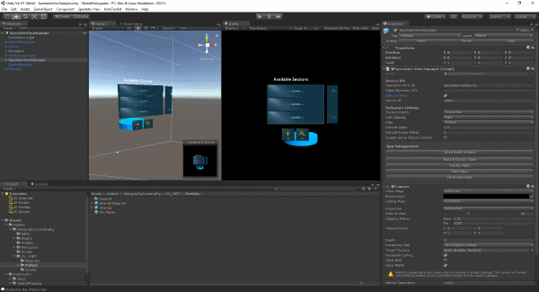
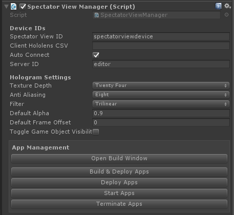

# README

**These instructions are for the UNET implementation of spectator view**
For the **HoloToolkit sharing service** implementation, see the [Legacy Documentation](../LegacyDocs/SharingService/Samples/README.md).

## Overview
Sample Unity projects to demonstrate the end to end process of rendering an application's view over an external camera's color image.  This app is a shared experiences using one or more HoloLens devices and Unity as clients.
Look at the [Holograms 240](https://developer.microsoft.com/en-us/windows/holographic/holograms_240) course in the Holographic Academy to learn more about the core tech.
Look at the **Player Controller** script and the [UNET documentation](https://docs.unity3d.com/Manual/UNet.html) for more information on the neworking stack.

The app has a directory "Assets\Addons\HolographicCameraRig" which, alongside HoloToolkit, includes everything you need for adding photo and video functionality to your own Unity app.

## Setup
+ Before launching Unity:
	+ Ensure CalibrationData.txt from your calibration has been copied to the root of your **Assets** directory.

	

	+ Build the UnityCompositorInterface and CompositorDLL in the Compositor sln (see Compositor Readme).
	+ Run CopyDLL to get compositor dependencies copied to your Unity project.
+ In the Unity Hierarchy Panel, select the **SpectatorViewManager** prefab:
    + Set the **Spectator View ID** field to the HoloLens name or the IP of the spectator view HoloLens attached to your camera.  This defaults to a spectator view HoloLens named "SpectatorViewDevice".  You can change your HoloLens' name in the device portal.
    + Set the **Server** field to be the HoloLens/ computer name or IP of the device you wish to host the session - for best results, this defaults to the Unity editor ("editor").
	+ Set the **Client HoloLens CSV** field to a comma separated list of HoloLens IPs that you wish to deploy to using the **App Management** buttons below.
    
	
	
+ Walk around your playspace with all of the HoloLens devices that will be in the experience, so each device has an internal model of the space that it is in.
+ Build and Deploy:
    + Build the application as a D3D UWP
    + Deploy the app to the HoloLens attached to your camera.
    + Deploy the app to any other HoloLens devices you want to see the experience.
+ Press **Play** in Unity to get realtime Hologram frames for the Compositor.
+ Open the Compositor in the Unity menu bar under "Spectator View\Compositor".

	

+ Ensure the Unity Game window is visible and "edit/ project settings/ player/ Run in Background" is checked for WSA and standalone.

	
    
+ If you have selected the **Auto Connect** checkbox on the SpectatorViewManager prefab, your clients will automatically join your shared session once the host device starts.
    + Otherwise, a network connection UI will appear on launch.  Select the session your Host started and then select Join.

## Adding spectator view support to your app
This sample project has been set up as a shared experience, but if you would like to add this functionality to your existing app, or would like to start from a new project, follow these instructions:
+ Copy **Assets\Addons\HolographicCameraRig** to **Assets\Addons\** in your project.
+ Download the latest [HoloToolkit](https://github.com/Microsoft/HoloToolkit-Unity) and add it to your project.
+ Add **Assets\Addons\HolographicCameraRig\Prefabs\SpectatorViewManager** to the root of your hierarchy.
+ Copy **CalibrationData.txt** to your Assets directory.
+ Populate the ID fields in SpectatorViewManager with the IP or name of your spectator view HoloLens and host device.

+ If your scene has any GameObjects you would not like in your photos or videos, hide their renderers in the Unity editor using the **HideRenderer** script or **SV_ToggleEnabled** scripts.
    + The Toggle script will allow you to enable or disable those GameObjects at runtime by pressing **T** in the Game window.

+ **DISCLAIMER:** Any interactions with the app will have to be networked events from your client HoloLens devices back to Unity.
    + If any app state in the device does not get updated in Unity, it will not appear in the Compositor.
    + Look at the **Player Controller** script and the [UNET documentation](https://docs.unity3d.com/Manual/UNet.html) for more information on Unity networking.
    
+ **DISCLAIMER:** If your application was already a shared experience, the sharing prefab or any of its child GameObjects should not be included twice.

## Documentation
+ [Overview](../README.md)
+ [Calibration](../Calibration/README.md)
+ [Compositor](../Compositor/README.md)
+ **Sample**