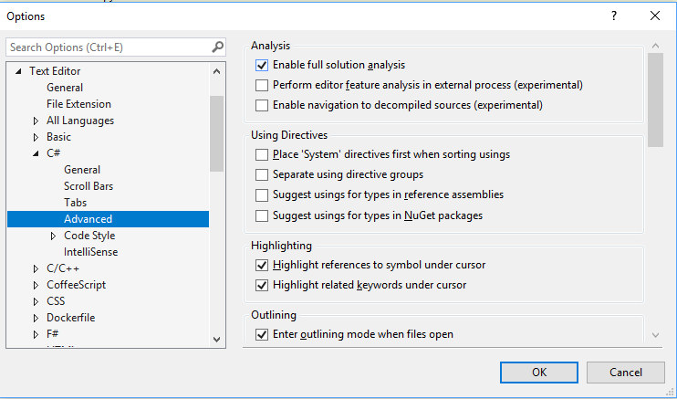
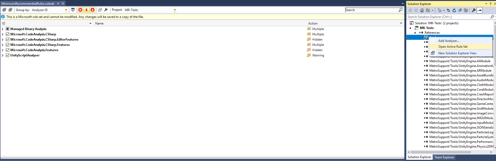
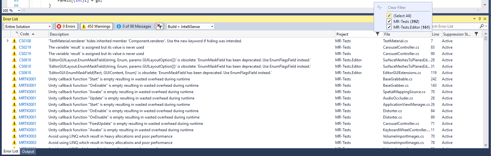

Unity Script Analyzer
=============

This project is a Visual Studio extension designed to analyze Unity C\# scripts
for “low hanging fruit” performance improvements.

The "UnityScriptAnalyzer" extension analyzes Unity C\# scripts statically
looking for key performance wins by primarily targeting known expensive function
calls/operations. This extension uses the same functionality that Visual Studio
provides for identifying warnings & errors (i.e the little squiggly lines you
see in your code) thus providing a suggestion to the developer to change their
code. Currently, also working on providing automatic code-fixes so users can
change their code automatically.

[Learn More about Roslyn Analyzers
here](https://msdn.microsoft.com/en-us/library/mt162308.aspx)

Getting Started
---------------

### Installing

Open the UnityScriptAnalyzer.sln file in Visual Studio and build the solution.

To install this extension, just double click the .VSIX file, after building your
solution under UnityScriptAnalyzer.Vsix\\bin\\debug or
release\\UnityScriptAnalyzer.vsix, and follow on-screen instructions to complete
installation.

Currently supports editions of Visual Studio 2017.

Things to Know
--------------

### Enable Analysis for Full Solution

Currently this Visual Studio extension only analyzes open source files. To
analyze your entire project solution, go to Tools -\> Options -\> Text Editor
-\> C\# -\> Advanced -\> "Enable full solution analysis"

### Enable/Disable Individual Warnings

To turn off certain warnings, in Solution Explorer -\> under Project -\> under
References -\> right click “Analyzers” -\> “Open Active Rule Set”

### Suppress Warnings for Sections of Code

If you want the analyzer to ignore a particular section of code, add the
following pragma around your desired region.

~~~~~~~~~~~~~~~~~~~~~~~~~~~~~~~~~~~~~~~~~~~~~~~~~~~~~~~~~~~~~~~~~~~~~~~~~ csharp
#pragma warning disable MRTK0009

...lines of code to ignore warning...

#pragma warning restore MRTK0009
~~~~~~~~~~~~~~~~~~~~~~~~~~~~~~~~~~~~~~~~~~~~~~~~~~~~~~~~~~~~~~~~~~~~~~~~~~~~~~~~

### Filter ErrorList

Warnings can be found in the ErrorList window by going to "View" in VS toolbar
-\> click "Error List" about half way down

In the Error List window, you can filter to only warnings and/or errors. You can
also filter on the Code column to select only USA warnings. Likewise, hover on
the Project and other columns to filter results.

### Enable/Disable Entire VSIX

You can manage your Visual Studio extensions by going to "Tools" in the VS
toolbar -\> "Extensions and Updates" near the top. Find UnityScriptAnalyzer in
the middle list that appears in resulting opened window.

Rule Appendix
-------------

| Rule code | Explanation                                                                                                                                                                              |
|-----------|------------------------------------------------------------------------------------------------------------------------------------------------------------------------------------------|
| USA0001   | Unity callback function "Start" is empty resulting in wasted overhead during runtime                                                                                                     |
| USA0002   | Avoid using GetComponent(String). Use the much less expensive GetComponent() version                                                                                                     |
| USA0003   | Avoid using LINQ which result in heavy allocations and poor performance                                                                                                                  |
| USA0004   | Unity SendMessage & BroadcastMessage functions are extremely expensive. Replace anywhere used with direct calls via casting if needed                                                    |
| USA0005   | Consider using less expensive DateTime.UtcNow instead of DateTime.Now if applicable                                                                                                      |
| USA0006   | Consider using sqrMagnitude if applicable instead of magnitude in order to eliminate expensive sqrt calculations                                                                         |
| USA0007   | Consider using sqrMagnitude if applicable instead of Distance() to eliminate expensive sqrt calculations                                                                                 |
| USA0008   | If used repeatedly, consider calling UnityEngine.Material.SetFloat(string, float) with an integer key obtained via Shader.PropertyToId(string), instead of using the string key directly |
| USA0009   | If used repeatedly, consider UnityEngine.Animator.SetBool(string, bool) with an integer key obtained via Shader.PropertyToId(string), instead of using the string key directly           |
| USA0010   | Using function form "UnityEngine.Physics.Raycast(UnityEngine.Ray)", consider adding layerMask argument to optimize raycast performance                                                   |
| USA0011   | Avoid using Lambdas as they cause additional Garbage Collection allocations                                                                                                              |
| USA0012   | Use of expensive function (various functions - see list below) has high overhead in repeating Unity callback function                                                                    |
| USA0013   | Use of Camera.main actually involves a lookup for MainCamera every access. Consider cache reference instead                                                                              |
| USA0014   | Use CompareTag() to make a string comparison with GameObject.Tag or Component.Tag                                                                                                        |
| USA0015   | Mesh.Vertices returns an array copy of the data. Consider saving pointer reference to data if performing multiple access                                                                 |

### USA0001 Example

Empty Unity Callbacks function such as Start and Update although empty of
statements still cause overhead at runtime. This can be very costly especially
for empty callbacks attached to a high number of gameobjects and thus high
instance at runtime

~~~~~~~~~~~~~~~~~~~~~~~~~~~~~~~~~~~~~~~~~~~~~~~~~~~~~~~~~~~~~~~~~~~~~~~~~ csharp
public void Update()
{

}
~~~~~~~~~~~~~~~~~~~~~~~~~~~~~~~~~~~~~~~~~~~~~~~~~~~~~~~~~~~~~~~~~~~~~~~~~~~~~~~~

### USA0002 Example

There are different versions of the GetComponent function from UnityEngine. The
version that looks up by string key is orders of magnitude slower than the
template function version

~~~~~~~~~~~~~~~~~~~~~~~~~~~~~~~~~~~~~~~~~~~~~~~~~~~~~~~~~~~~~~~~~~~~~~~~~ csharp
// USE:
GetComponent<T>()

// NOT:
GetComponent(string)
~~~~~~~~~~~~~~~~~~~~~~~~~~~~~~~~~~~~~~~~~~~~~~~~~~~~~~~~~~~~~~~~~~~~~~~~~~~~~~~~

### USA0003 Example

LINQ, although very useful for writing queries against collections of data, can
be extremely costly both from memory and CPU overhead. Generally avoid use of
LINQ except for required scenarios or use in editor scripts.

~~~~~~~~~~~~~~~~~~~~~~~~~~~~~~~~~~~~~~~~~~~~~~~~~~~~~~~~~~~~~~~~~~~~~~~~~ csharp
using System.Linq;

List<int> data = new List<int>();
data.Any(x => x > 10);

var result = from x in data
             where x > 10
             select x;
~~~~~~~~~~~~~~~~~~~~~~~~~~~~~~~~~~~~~~~~~~~~~~~~~~~~~~~~~~~~~~~~~~~~~~~~~~~~~~~~

### USA0004 Example

Although the UnityEngine functions
[GameObject.SendMessage](https://docs.unity3d.com/ScriptReference/GameObject.SendMessage.html)
and
[GameObject.BroadcastMessage](https://docs.unity3d.com/ScriptReference/GameObject.BroadcastMessage.html)
appear very useful, they are prohibitively expensive in practice - on the order
of 1000x slower than direct function calls. Whenever possible, avoid use of
these functions.

~~~~~~~~~~~~~~~~~~~~~~~~~~~~~~~~~~~~~~~~~~~~~~~~~~~~~~~~~~~~~~~~~~~~~~~~~ csharp
using UnityEngine;
using System.Collections;

public class ExampleClass : MonoBehaviour {
    void ApplyDamage(float damage) {
        print(damage);
    }
    void Example() {
        gameObject.SendMessage("ApplyDamage", 5.0F);
    }
}
~~~~~~~~~~~~~~~~~~~~~~~~~~~~~~~~~~~~~~~~~~~~~~~~~~~~~~~~~~~~~~~~~~~~~~~~~~~~~~~~

### USA0005 Example

DateTime.Now is more costly to use than it's counterpart, DateTime.UtcNow, due
to the lookup/calculation work need to adjust for the timezone of the running
host machine. DateTime.UtcNow can be about 4x faster. Unless the current local
time is required, generally try to use

~~~~~~~~~~~~~~~~~~~~~~~~~~~~~~~~~~~~~~~~~~~~~~~~~~~~~~~~~~~~~~~~~~~~~~~~~ csharp
DateTime dt = DateTime.Now;
DateTime dt_utc = DateTime.UtcNow;
~~~~~~~~~~~~~~~~~~~~~~~~~~~~~~~~~~~~~~~~~~~~~~~~~~~~~~~~~~~~~~~~~~~~~~~~~~~~~~~~

### USA0006 Example

Use of Vector3.magnitude and Vector2.magnitude require use of sqrt() function
call to satisfy the equation sqrt(x\^2 + y\^2 + z\^2). On many platforms, the
sqrt operation can be significantly more expensive than the three multiplication
operations and additions. Thus, if appropriate, consider using the sqrMagnitude
field of Vector3 and Vector2 for performance gains, especially in hot code
paths.

~~~~~~~~~~~~~~~~~~~~~~~~~~~~~~~~~~~~~~~~~~~~~~~~~~~~~~~~~~~~~~~~~~~~~~~~~ csharp
bool distanceCheck(Vector3 vec)
{
    float distanceThreshold = 15.0f;

    // Instead of this
    return vec.magnitude > distanceThreshold;

    // consider using this
    return vec.sqrMagnitude > (distanceThreshold * distanceThreshold);
}
~~~~~~~~~~~~~~~~~~~~~~~~~~~~~~~~~~~~~~~~~~~~~~~~~~~~~~~~~~~~~~~~~~~~~~~~~~~~~~~~

### USA0007 Example

The Vector3.Distance and Vector2.Distance functions are similar to magnitude in
that they require a sqrt operation on the CPU. The sqrtMagnitude can give
performance gains in this scenario as well.

~~~~~~~~~~~~~~~~~~~~~~~~~~~~~~~~~~~~~~~~~~~~~~~~~~~~~~~~~~~~~~~~~~~~~~~~~ csharp
bool distanceCheck(Vector3 start, Vector3 end)
{
    float distanceThreshold = 15.0f;

    // Instead of this
    return Vector3.Distance(start, end) > distanceThreshold;

    // consider using this
    return (star - end).sqrMagnitude > (distanceThreshold * distanceThreshold);
}
~~~~~~~~~~~~~~~~~~~~~~~~~~~~~~~~~~~~~~~~~~~~~~~~~~~~~~~~~~~~~~~~~~~~~~~~~~~~~~~~

### USA0008 Example

The Material class in UnityEngine has a number of Set\* and Get\* operations
that take in a key value to determine what shader property to set or get. These
functions are overloaded to accept a string key value or an integer key value.
If regularly setting shader properties for various materials, use the integer
key version of this function as the string key look up is generally more costly.
This is done by using the provided function Shader.PropertyToId(string key) to
obtain the associated integer key value for your string key. This value should
be obtained at the start of your script and cached for use later on. Unity
assigns an int ID value for every shader property and this integer does not
change throughout the runtime of a given game. However, note, this value will
change between runtimes so it cannot be cached to disk.

~~~~~~~~~~~~~~~~~~~~~~~~~~~~~~~~~~~~~~~~~~~~~~~~~~~~~~~~~~~~~~~~~~~~~~~~~ csharp
using UnityEngine;
using System.Collections;

public class ExampleClass : MonoBehaviour 
{   
    private Material mat;
    private int myPropertyId;

    void Start() 
    {
        mat = GetComponent<Renderer>().material;
        myPropertyId = Shader.PropertyToId("_MyShaderProp");
    }

    void Update() 
    {
        float newValue = (...some condition ? 1.0f : 0.0f);

        mat.SetFloat(myPropertyId, newValue);
    }
}
~~~~~~~~~~~~~~~~~~~~~~~~~~~~~~~~~~~~~~~~~~~~~~~~~~~~~~~~~~~~~~~~~~~~~~~~~~~~~~~~

### USA0009 Example

Likewise, the Animator class has many get/set functions to set values for
various animation properties. These functions also can accept an int or string
key value. Use the provided function Animator.StringToHash(string) to generate
the appropriate integer ID value.

~~~~~~~~~~~~~~~~~~~~~~~~~~~~~~~~~~~~~~~~~~~~~~~~~~~~~~~~~~~~~~~~~~~~~~~~~ csharp
    int myPropertyId = Animator.StringToHash("_MyAnimProp");        
    Animator.SetFloat(myPropertyId, newValue);
~~~~~~~~~~~~~~~~~~~~~~~~~~~~~~~~~~~~~~~~~~~~~~~~~~~~~~~~~~~~~~~~~~~~~~~~~~~~~~~~

### USA0010 Example

The useful UnityEngine function
[Physics.Raycast](https://docs.unity3d.com/ScriptReference/Physics.Raycast.html)
and
[Physics.RaycastAll](https://docs.unity3d.com/ScriptReference/Physics.RaycastAll.html)
have many overload versions. One of these arguments can optimize your CPU
performance by filter the selection of valid candidates for your Raycast
operation. The layerMask parameter allows you to filter only to entities of
particular layer(s).

Also look at using the [LayerMask.GetMask(string[]
layerNames)](https://docs.unity3d.com/ScriptReference/LayerMask.GetMask.html)
provided function to easily get the layerMask int parameter for one or many
layer string names.

~~~~~~~~~~~~~~~~~~~~~~~~~~~~~~~~~~~~~~~~~~~~~~~~~~~~~~~~~~~~~~~~~~~~~~~~~ csharp
using UnityEngine;

public class ExampleClass : MonoBehaviour
{
    // C# example.
    void Update()
    {
        // Bit shift the index of the layer (8) to get a bit mask
        int layerMask = 1 << 8;

        // This would cast rays only against colliders in layer 8.
        // But instead we want to collide against everything except layer 8. The ~ operator does this, it inverts a bitmask.
        layerMask = ~layerMask;

        RaycastHit hit;
        // Does the ray intersect any objects excluding the player layer
        if (Physics.Raycast(transform.position, transform.TransformDirection(Vector3.forward), out hit, Mathf.Infinity, layerMask))
        {
            Debug.DrawRay(transform.position, transform.TransformDirection(Vector3.forward) * hit.distance, Color.yellow);
            Debug.Log("Did Hit");
        }
        else
        {
            Debug.DrawRay(transform.position, transform.TransformDirection(Vector3.forward) * 1000, Color.white);
            Debug.Log("Did not Hit");
        }
    }
}
~~~~~~~~~~~~~~~~~~~~~~~~~~~~~~~~~~~~~~~~~~~~~~~~~~~~~~~~~~~~~~~~~~~~~~~~~~~~~~~~

### USA0011 Example

Lambdas, although useful to write, add additional memory and garbage collection
work to your game. Generally try to avoid use of these.

~~~~~~~~~~~~~~~~~~~~~~~~~~~~~~~~~~~~~~~~~~~~~~~~~~~~~~~~~~~~~~~~~~~~~~~~~ csharp
Func<int, bool> myFunc = x => x == 5;  
bool result = myFunc(4); // returns false of course  
~~~~~~~~~~~~~~~~~~~~~~~~~~~~~~~~~~~~~~~~~~~~~~~~~~~~~~~~~~~~~~~~~~~~~~~~~~~~~~~~

### USA0012 Example

This rule looks for particularly expensive Unity functions used in repeating
Unity callbacks such as Update or FixedUpdate. Since these are generally hot
code paths and the resulting functions can be very expensive, they should be
given consideration if they can be moved to a Start() or Awake() function or
called on some less frequent basis such as every 3 frames, etc.

~~~~~~~~~~~~~~~~~~~~~~~~~~~~~~~~~~~~~~~~~~~~~~~~~~~~~~~~~~~~~~~~~~~~~~~~~ csharp
void Update()
{
    // Flags use of any functions below used in Unity callback functions called every frame
    UnityEngine.Object.GetComponent
    UnityEngine.Object.Instantiate
    UnityEngine.Object.Find
    UnityEngine.Object.FindWithTag
    UnityEngine.Object.FindObjectOfType
    UnityEngine.Object.FindObjectsOfType
    UnityEngine.Object.FindGameObjectsWithTag
    UnityEngine.Object.FindGameObjectsWithTag
    UnityEngine.Physics.Raycast
    UnityEngine.Physics.RaycastAll
}
~~~~~~~~~~~~~~~~~~~~~~~~~~~~~~~~~~~~~~~~~~~~~~~~~~~~~~~~~~~~~~~~~~~~~~~~~~~~~~~~

### USA0013 Example

Camera.main is another very useful Unity provided function to retrieve a pointer
to the MainCamera of your Unity scene. However, this property can be costly to
access as Unity must search for the MainCamera every property request. This is
due to the fact that MainCamera can change during a scene runtime. If you know
your scene or at least script in question only uses one MainCamera, then you
should cache a reference to Camera.main, especially if you make use of the
Camera every frame such as in an Update() callback.

[See more info
here](https://support.unity3d.com/hc/en-us/articles/115000227183-Camera-main-is-slow)

~~~~~~~~~~~~~~~~~~~~~~~~~~~~~~~~~~~~~~~~~~~~~~~~~~~~~~~~~~~~~~~~~~~~~~~~~ csharp
using UnityEngine;
using System.Collections;

public class ExampleClass : MonoBehaviour 
{   
    private Camera cam;

    void Start() 
    {
        cam = Camera.main;
    }

    void Update() 
    {
        this.transform.position = cam.transform.position + cam.transform.forward * 10.0f;
    }
}
~~~~~~~~~~~~~~~~~~~~~~~~~~~~~~~~~~~~~~~~~~~~~~~~~~~~~~~~~~~~~~~~~~~~~~~~~~~~~~~~

### USA0014 Example

Accessing string properties of GameObject such as name and tag, actual incur a
higher cost than expected because of the native/managed boundary. Generally, the
tag property is accessed to perform an equality operation. It is more performant
to use the Unity provided CompareTag() function instead of accessing the Tag
property and using string.Equals() or == binary operator.

~~~~~~~~~~~~~~~~~~~~~~~~~~~~~~~~~~~~~~~~~~~~~~~~~~~~~~~~~~~~~~~~~~~~~~~~~ csharp
using UnityEngine;

public class ExampleClass : MonoBehaviour 
{   
    void Update() 
    {
        if (this.CompareTag("test comparison"))
        {
            // do something amazing
        }
    }
}
~~~~~~~~~~~~~~~~~~~~~~~~~~~~~~~~~~~~~~~~~~~~~~~~~~~~~~~~~~~~~~~~~~~~~~~~~~~~~~~~

### USA0015 Example

The Mesh.Vertices property returns a list of vertices for the associated mesh.
However, this operation is done via allocation/copy and not a return by
reference. Thus, any element index access on this property (which is common for
a loop through all vertices) will incur a huge performance hit especially if the
mesh has many vertices. The developer should save a reference to the copied
vertices array and then perform the index operation.

[See more info
here](https://docs.unity3d.com/ScriptReference/Mesh-vertices.html)

~~~~~~~~~~~~~~~~~~~~~~~~~~~~~~~~~~~~~~~~~~~~~~~~~~~~~~~~~~~~~~~~~~~~~~~~~ csharp
using UnityEngine;
using System.Collections;

public class ExampleClass : MonoBehaviour {
    void Update() {
        Mesh mesh = GetComponent<MeshFilter>().mesh;
        Vector3[] vertices = mesh.vertices;
        int i = 0;
        while (i < vertices.Length) {
            vertices[i] += Vector3.up * Time.deltaTime;
            i++;
        }
        mesh.vertices = vertices;
        mesh.RecalculateBounds();
    }
}
~~~~~~~~~~~~~~~~~~~~~~~~~~~~~~~~~~~~~~~~~~~~~~~~~~~~~~~~~~~~~~~~~~~~~~~~~~~~~~~~

Authors
-------

-   **Troy Ferrell** - *Initial work*
